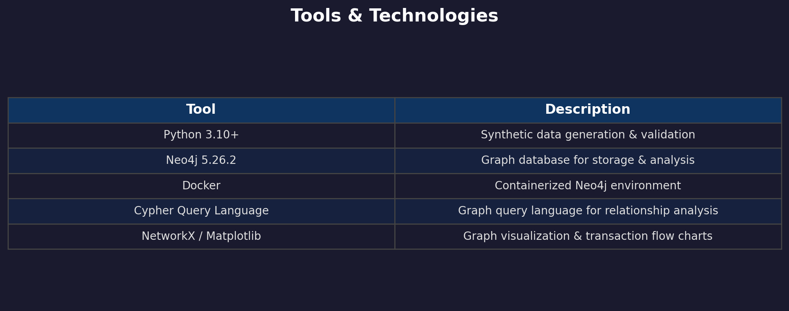
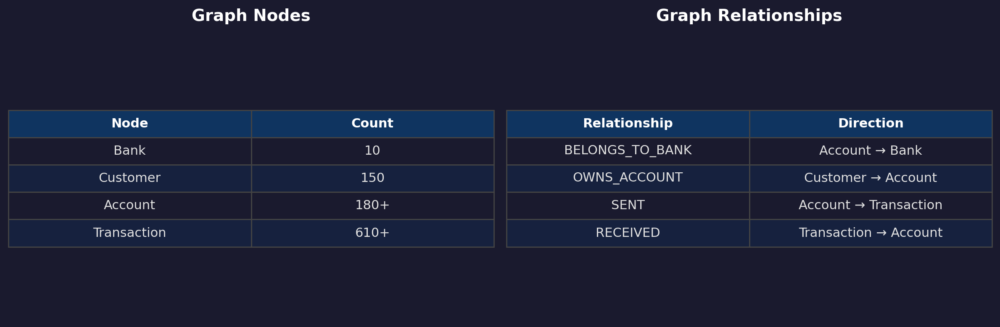
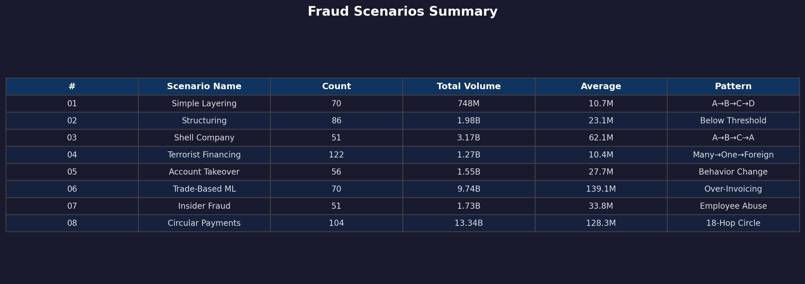

<div dir="rtl">

# شبیه‌سازی سناریوهای تقلب در نظام بانکی ایران

## گزارش فنی جامع

**تهیه‌کننده:** Mohammad Motiebirjandi  
**تاریخ:** اسفند ۱۴۰۴  
**پایگاه داده:** Neo4j 5.26.2

---

## ۱. مقدمه و اهداف پروژه

این پروژه با هدف شبیه‌سازی سناریوهای مختلف تقلب در سیستم بانکی ایران طراحی شده‌ است. در این راستا، هشت سناریوی متنوع از تقلب‌های رایج در نظام بانکی شناسایی و با داده‌های مصنوعی ولی واقع‌گرایانه پیاده‌سازی شده‌اند.

داده‌های تولید شده شامل ۱۸۰ حساب بانکی متعلق به ۱۵۰ مشتری در ۱۰ بانک ایرانی است که در مجموع ۶۱۰ تراکنش در هشت سناریو تولید شده است. تمامی داده‌ها به پایگاه داده گرافی Neo4j وارد شده و امکان تحلیل روابط پیچیده بین حساب‌ها و تراکنش‌ها را فراهم می‌آورد.

### ۱.۱ ابزارها و فناوری‌های مورد استفاده

| ابزار | توضیحات |
|--------|----------|
| Python 3.10+ | تولید داده‌های مصنوعی و اعتبارسنجی |
| Neo4j 5.26.2 | پایگاه داده گرافی برای ذخیره و تحلیل |
| Docker | اجرای محیط Neo4j به صورت کانتینری |
| Cypher Query Language | زبان پرس‌وجوی گراف برای تحلیل روابط |
| NetworkX / Matplotlib | تحلیل و مصورسازی گراف تراکنش‌ها |



---

## ۲. روش تولید داده

داده‌های این پروژه به صورت برنامه‌نویسی شده و کاملاً مصنوعی هستند ولی با رعایت استانداردهای واقعی بانکی ایران تولید شده‌اند.

### ۲.۱ تولید حساب‌ها

این اسکریپت ۱۸۰ حساب بانکی با شماره شبای معتبر (۲۶ کاراکتری با الگوریتم mod-97)، کد ملی معتبر (۱۰ رقمی با رقم کنترل)، و شناسه شهاب برای ۱۵۰ مشتری در ۱۰ بانک مختلف ایرانی تولید می‌کند.

### ۲.۲ تولید تراکنش‌ها

برای هر سناریو، ترکیبی از تراکنش‌های مشکوک و معمولی تولید شده است. هر تراکنش دارای ۱۲ فیلد شامل شناسه تراکنش، تاریخ، ساعت، شبای فرستنده، شبای گیرنده، مبلغ، ارز، نوع، توضیحات، شماره مرجع، کانال و وضعیت است.

---

## ۳. اعتبارسنجی داده‌ها

پس از تولید داده‌ها، فرایند اعتبارسنجی جامعی برای اطمینان از کیفیت و درستی داده‌ها انجام شد.

### ۳.۱ تصویر وضعیت داده‌ها

| شاخص | مقدار | وضعیت |
|-------|-------|--------|
| Total Accounts | 180 | PASS |
| Total Customers | 150 | PASS |
| Total Transactions | 610 | PASS |
| Null in sender_sheba | 0 | PASS |
| Null in receiver_sheba | 0 | PASS |
| Duplicate Transactions | 0 | PASS |
| Negative Amounts | 0 | PASS |
| Zero Amounts | 4 (Scenario 07) | WARN |


---

## ۴. مدل گرافی Neo4j

پایگاه داده گرافی Neo4j برای نمایش روابط بین حساب‌ها، مشتریان، بانک‌ها و تراکنش‌ها استفاده شد. این ساختار امکان تحلیل جریان پول و شناسایی الگوهای تقلب را فراهم می‌کند.

### ۴.۱ گره‌ها (Nodes)

| گره | تعداد |
|------|-------|
| Bank | 10 |
| Customer | 150 |
| Account | 180+ |
| Transaction | 610+ |

### ۴.۲ روابط (Relationships)

| رابطه | جهت |
|--------|------|
| BELONGS_TO_BANK | Account → Bank |
| OWNS_ACCOUNT | Customer → Account |
| SENT | Account → Transaction |
| RECEIVED | Transaction → Account |



### ۴.۳ نمای کلی گراف


---

## ۵. خلاصه سناریوهای تقلب

جدول زیر خلاصه اطلاعات هشت سناریوی اصلی تقلب بانکی را نشان می‌دهد:

| # | نام سناریو | تعداد تراکنش | حجم کل | میانگین | الگو |
|---|------------|--------------|--------|---------|------|
| 01 | لایه‌گذاری ساده | 70 | 748M | 10.7M | A→B→C→D |
| 02 | خرد کردن تراکنش | 86 | 1.98B | 23.1M | Below Threshold |
| 03 | شرکت‌های کاغذی | 51 | 3.17B | 62.1M | A→B→C→A |
| 04 | تامین مالی تروریسم | 122 | 1.27B | 10.4M | Many→One→Foreign |
| 05 | تصاحب حساب | 56 | 1.55B | 27.7M | Behavior Change |
| 06 | پولشویی مبتنی بر تجارت | 70 | 9.74B | 139.1M | Over-Invoicing |
| 07 | تقلب کارمند بانک | 51 | 1.73B | 33.8M | Employee Abuse |
| 08 | پرداخت‌های دایره‌ای | 104 | 13.34B | 128.3M | 18-Hop Circle |




---

## ۶. سناریوی ۰۱: لایه‌گذاری ساده (Simple Layering)

### ۶.۱ توضیح سناریو

در این سناریو، وجوه غیرقانونی به سرعت از طریق چندین حساب جابجا می‌شود (A→B→C→D) تا ردیابی منشاء آن دشوار گردد. در هر لایه، درصدی به عنوان کارمزد کسر می‌شود.

**آمار:**
- الگو: A→B→C→D
- تعداد تراکنش: 70
- تراکنش‌های مشکوک: ~15
- تراکنش‌های معمولی: ~55
- حجم کل: 748M IRR
- میانگین: 10.7M IRR

### ۶.۲ نشانگرهای تقلب

- انتقال سریع در ۳ روز
- کاهش تدریجی مبلغ
- اشتراک اطلاعات تماس
- فعالیت غیرعادی حساب D

### ۶.۳ تصاویر گراف


### ۶.۴ کوئری Cypher

```cypher
MATCH path=(a1:Account)-[:SENT]->(tx1:Transaction)-[:RECEIVED]->(a2:Account)-[:SENT]->(tx2:Transaction)-[:RECEIVED]->(a3:Account)
WHERE tx1.scenario = 'scenario_01' AND tx2.scenario = 'scenario_01'
  AND tx1.amount >= 40000000
RETURN path
LIMIT 50
```

---

## ۷. سناریوی ۰۲: خرد کردن تراکنش (Structuring / Smurfing)

### ۷.۱ توضیح سناریو

مبالغ بزرگ به تراکنش‌های کوچکتر از سقف گزارش‌دهی (۵۰ میلیون ریال) تقسیم می‌شوند. ۱۵ تراکنش هرکدام ۴۵ میلیون ریال از حساب‌های مختلف به یک حساب تجمیع‌کننده واریز شده و سپس ۶۵۰ میلیون ریال به خارج انتقال می‌یابد.

**آمار:**
- الگو: Below Threshold
- تعداد تراکنش: 86
- تراکنش‌های مشکوک: ~50
- تراکنش‌های معمولی: ~35
- حجم کل: 1.98B IRR
- میانگین: 23.1M IRR

### ۷.۲ نشانگرهای تقلب

- مبالغ تکراری زیر سقف
- حساب‌های مرتبط با IP مشترک
- خوشه‌بندی زمانی
- تجمیع نهایی

### ۷.۳ تصاویر گراف


### ۷.۴ کوئری Cypher

```cypher
MATCH (a:Account)-[:SENT]->(tx:Transaction)
WHERE tx.scenario = 'scenario_02'
  AND tx.amount >= 40000000 AND tx.amount <= 50000000
RETURN a.sheba AS sender, tx.amount AS amount, tx.date AS date
ORDER BY tx.date
```

---

## ۸. سناریوی ۰۳: شبکه شرکت‌های کاغذی (Shell Company Network)

### ۸.۱ توضیح سناریو

سه شرکت کاغذی با آدرس مسکونی مشترک و فاکتورهای مبهم تراکنش‌های دایره‌ای انجام می‌دهند: A→B→C→A. این چرخه با استخراج ارزش در هر مرحله تکرار می‌شود.

**آمار:**
- الگو: A→B→C→A
- تعداد تراکنش: 51
- تراکنش‌های مشکوک: ~25
- تراکنش‌های معمولی: ~25
- حجم کل: 3.17B IRR
- میانگین: 62.1M IRR

### ۸.۲ نشانگرهای تقلب

- جریان دایره‌ای وجوه
- فاکتورهای مبهم
- آدرس مسکونی
- عدم فعالیت تجاری واقعی

### ۸.۳ تصاویر گراف


### ۸.۴ کوئری Cypher

```cypher
MATCH path=(a1:Account)-[:SENT]->(tx1:Transaction {scenario:'scenario_03'})-[:RECEIVED]->(a2:Account)-[:SENT]->(tx2:Transaction {scenario:'scenario_03'})-[:RECEIVED]->(a3:Account)-[:SENT]->(tx3:Transaction {scenario:'scenario_03'})-[:RECEIVED]->(a4:Account)
WHERE a1.sheba = a4.sheba OR tx1.amount >= 100000000
RETURN path LIMIT 50
```

---

## ۹. سناریوی ۰۴: تامین مالی تروریسم (Terrorist Financing)

### ۹.۱ توضیح سناریو

۵۰ اهداکننده مبالغ کوچک به حساب یک موسسه خیریه واریز می‌کنند. موسسه خیریه ۲۰۰ میلیون ریال را به یک NGO انتقال داده و NGO نیز ۱۸۰ میلیون را به یک نهاد خارجی منتقل می‌کند.

**آمار:**
- الگو: Many→One→Foreign
- تعداد تراکنش: 122
- تراکنش‌های مشکوک: ~80
- تراکنش‌های معمولی: ~40
- حجم کل: 1.27B IRR
- میانگین: 10.4M IRR

### ۹.۲ نشانگرهای تقلب

- الگوی تجمیع (کوچک→بزرگ)
- عبور سریع وجوه
- ذی‌نفع خارجی
- اهداکنندگان خارجی

### ۹.۳ تصاویر گراف


### ۹.۴ کوئری Cypher

```cypher
MATCH (donor:Account)-[:SENT]->(tx:Transaction {scenario:'scenario_04'})-[:RECEIVED]->(hub:Account)
WITH hub, count(DISTINCT donor) AS donor_count, sum(tx.amount) AS total
WHERE donor_count >= 3
RETURN hub.sheba, donor_count, total
ORDER BY total DESC
```

---

## ۱۰. سناریوی ۰۵: تصاحب حساب (Account Takeover)

### ۱۰.۱ توضیح سناریو

حساب یک مشتری قدیمی با واریزی‌های منظم بازنشستگی (۲۵ میلیون ماهانه) مورد تصاحب قرار می‌گیرد. پس از تغییر اطلاعات تماس، انتقال ۵۰۰ میلیون ریالی به ذی‌نفع جدید و سه انتقال سریع بعدی صورت می‌گیرد.

**آمار:**
- الگو: Behavior Change
- تعداد تراکنش: 56
- تراکنش‌های مشکوک: ~20
- تراکنش‌های معمولی: ~35
- حجم کل: 1.55B IRR
- میانگین: 27.7M IRR

### ۱۰.۲ نشانگرهای تقلب

- تغییر ناگهانی رفتار
- افزودن امضاکننده جدید
- انتقال بزرگ به ذی‌نفع ناشناس
- بستن سریع حساب

### ۱۰.۳ تصاویر گراف


### ۱۰.۴ کوئری Cypher

```cypher
MATCH (a:Account)-[:SENT]->(tx:Transaction {scenario:'scenario_05'})
WITH a, tx ORDER BY tx.date
WITH a, collect(tx.amount) AS amounts, collect(tx.date) AS dates
WHERE size(amounts) > 3
RETURN a.sheba, amounts, dates
```

---

## ۱۱. سناریوی ۰۶: پولشویی مبتنی بر تجارت (Trade-Based Money Laundering)

### ۱۱.۱ توضیح سناریو

یک شرکت واردکننده کالایی را با فاکتور ۱ میلیارد ریالی وارد می‌کند در حالی که ارزش واقعی ۲۰۰ میلیون ریال است (۸۰٪ بیش‌فاکتوری). پرداخت از طریق واسطه منطقه آزاد مسیریابی شده و ۱۵٪ کارمزد در هر چرخه کسر می‌شود.

**آمار:**
- الگو: Over-Invoicing
- تعداد تراکنش: 70
- تراکنش‌های مشکوک: ~30
- تراکنش‌های معمولی: ~40
- حجم کل: 9.74B IRR
- میانگین: 139.1M IRR

### ۱۱.۲ نشانگرهای تقلب

- فاکتورهای بیش از حد
- مسیریابی از منطقه آزاد
- شرکت‌های کاغذی
- تراکنش‌های پرارزش مشابه

### ۱۱.۳ تصاویر گراف


### ۱۱.۴ کوئری Cypher

```cypher
MATCH (sender:Account)-[:SENT]->(tx:Transaction {scenario:'scenario_06'})-[:RECEIVED]->(receiver:Account)
WHERE tx.amount > 500000000
RETURN sender.sheba AS sender, receiver.sheba AS receiver, tx.amount AS amount, tx.date AS date
ORDER BY tx.amount DESC
```

---

## ۱۲. سناریوی ۰۷: تقلب کارمند بانک (Insider Fraud)

### ۱۲.۱ توضیح سناریو

یک کارمند بانک از دسترسی خود سوءاستفاده کرده و از حساب‌های راکد، سالمندان و متوفیان برداشت غیرمجاز انجام می‌دهد. تمام ۱۲ حساب توسط یک شعبه (۵۶۹۲۴۱۲) مدیریت می‌شوند.

**آمار:**
- الگو: Employee Abuse
- تعداد تراکنش: 51
- تراکنش‌های مشکوک: ~15
- تراکنش‌های معمولی: ~35
- حجم کل: 1.73B IRR
- میانگین: 33.8M IRR

### ۱۲.۲ نشانگرهای تقلب

- فعال‌سازی حساب‌های راکد
- هدف‌گیری آسیب‌پذیران
- یک شعبه مشترک
- KYC ناقص
- انتقال به ذی‌نفعان مشترک

### ۱۲.۳ تصاویر گراف


### ۱۲.۴ کوئری Cypher

```cypher
MATCH (victim:Account)-[:SENT]->(tx:Transaction {scenario:'scenario_07'})-[:RECEIVED]->(beneficiary:Account)
WHERE victim.branch_code = '5692412'
RETURN victim.sheba AS victim, beneficiary.sheba AS beneficiary, tx.amount AS amount, tx.date AS date
ORDER BY tx.date
```

---

## ۱۳. سناریوی ۰۸: پرداخت‌های دایره‌ای (Circular Payments)

### ۱۳.۱ توضیح سناریو

یک شبکه پیچیده از ۲۰ حساب که وجوه از طریق ۱۵-۱۸ گام به نقطه شروع بازمی‌گردد. در هر گام ۵٪ کارمزد کسر شده و مسیرهای موازی برای ابهام‌سازی استفاده می‌شود.

**آمار:**
- الگو: 18-Hop Circle
- تعداد تراکنش: 104
- تراکنش‌های مشکوک: ~70
- تراکنش‌های معمولی: ~35
- حجم کل: 13.34B IRR
- میانگین: 128.3M IRR

### ۱۳.۲ نشانگرهای تقلب

- جریان دایره‌ای به مبداء
- شبکه پیچیده
- کارمزد در هر لایه
- تاخیر زمانی
- مسیرهای موازی

### ۱۳.۳ تصاویر گراف


### ۱۳.۴ کوئری Cypher

```cypher
MATCH path = (a:Account)-[:SENT]->(:Transaction {scenario:'scenario_08'})-[:RECEIVED]->(b:Account)
WITH a, b, count(*) AS tx_count
WHERE tx_count > 1
MATCH p = (a)-[:SENT]->(tx:Transaction {scenario:'scenario_08'})-[:RECEIVED]->(b)
RETURN p LIMIT 80
```

---

## ۱۴. نتیجه‌گیری

در این پروژه هشت سناریوی اصلی تقلب بانکی با داده‌های واقع‌گرایانه شبیه‌سازی شد. این سناریوها طیف گسترده‌ای از تقلب‌های رایج بانکی را پوشش می‌دهند از جمله لایه‌گذاری، خرد کردن، شرکت‌های کاغذی، تامین مالی تروریسم، تصاحب حساب، پولشویی مبتنی بر تجارت، تقلب داخلی و پرداخت‌های دایره‌ای.

استفاده از پایگاه داده گرافی Neo4j امکان تحلیل روابط پیچیده بین حساب‌ها، مشتریان و تراکنش‌ها را فراهم آورده و کوئری‌های Cypher ارائه شده ابزارهای عملی برای تشخیص هر نوع تقلب در اختیار تحلیلگران قرار می‌دهد.

با استفاده از این سامانه می‌توان سیاست‌های تشخیص تقلب را بهبود داد و از مخاطرات مالی و اعتباری بانکی کاهش داد.

---

## مراجع

- [FATF 40 Recommendations](https://www.fatf-gafi.org/publications/fatf-standards/)
- [FATF Typologies Reports](https://www.fatf-gafi.org/publications/typologies/)
- [Central Bank of Iran AML/CTF Regulations](https://www.cbi.ir/)
- [Iranian Banking Anti-Money Laundering Law](https://www.icana.ir/)

</div>
