<div dir="rtl">

# شبیه‌سازی سناریوهای تقلب در نظام بانکی ایران

## گزارش فنی جامع

**تهیه‌کننده:** Mohammad Motiebirjandi  
**تاریخ:** مهر ۱۴۰۵  
**پایگاه داده:** Neo4j 5.26.2

---

## ۱. مقدمه و اهداف پروژه

این پروژه 9 سناریوی تقلب و پولشویی را روی داده‌های کاملاً مصنوعی ولی نزدیک به واقعیتِ نظام بانکی ایران شبیه‌سازی می‌کند. هدف، آزمودن این است که تحلیل گرافی تا چه حد می‌تواند الگوهایی را که عمداً در میان فعالیت عادی پنهان شده‌اند پیدا کند.

داده‌ها شامل 180 حساب متعلق به 150 مشتری در ۱۰ بانک و 1665 تراکنش است که 228 مورد آن تراکنش کاشته‌شده تقلب و بقیه فعالیت عادی (نویز) است. همه داده‌ها در پایگاه داده گرافی Neo4j بارگذاری شده و یک API برای تحلیل مسیر روی آن ساخته شده است.

### ۱.۱ ابزارها و فناوری‌های مورد استفاده

| ابزار | توضیحات |
|---|---|
| Python 3.10+ | تولید داده مصنوعی، اعتبارسنجی و تحلیل |
| Neo4j 5.26.2 | پایگاه داده گرافی |
| Docker | اجرای Neo4j و API |
| Cypher | زبان پرس‌وجوی گراف |
| FastAPI | API تحلیل مسیر |
| NetworkX / Matplotlib | مصورسازی |

---

## ۲. روش تولید داده

داده‌ها با اسکریپت تولید می‌شوند و با seed ثابت کاملاً قابل بازتولید هستند. دو قید اصلی رعایت شده است: نزدیکی به داده واقعی بانکی، و پنهان بودن الگوی تقلب در میان نویز.

### ۲.۱ تولید حساب‌ها

- شماره شبا: ۲۶ کاراکتر با رقم کنترل mod-97 و شناسه واقعی بانک‌ها (مثلاً 017 ملی، 012 ملت، 057 پاسارگاد)
- شماره ملی اشخاص حقیقی: ۱۰ رقم با رقم کنترل معتبر
- شناسه ملی اشخاص حقوقی: ۱۱ رقم با رقم کنترل معتبر
- شناسه شهاب: ۱۶ رقم برای هر مشتری
- هر بانک شعبه‌های خود را دارد و حساب در شعبه همان بانک افتتاح می‌شود
- ۳۰ ستون فارسی مطابق قالب گزارش‌های واقعی بانکی؛ هر سطر یک رابطه مشتری–حساب (مالک، شریک، صاحب امضا)

### ۲.۲ تولید تراکنش‌ها

- انواع تراکنش: واریز نقدی، برداشت نقدی، انتقال داخلی (هم‌بانک)، پایا، و ساتنا (بین‌بانکی از ۱۵۰ میلیون ریال به بالا)
- تراکنش نقدی طرف مقابل ندارد: واریز نقدی بدون فرستنده و برداشت نقدی بدون گیرنده است
- تقویم هجری شمسی واقعی (طول ماه‌ها و سال کبیسه)
- تراکنش شعبه‌ای، پایا و ساتنا در روز جمعه انجام نمی‌شود
- کانال‌ها: اینترنت‌بانک، موبایل‌بانک، شعبه، ATM

### ۲.۳ نویز و پنهان‌سازی

در هر سناریو فعالیت عادی در تمام بازه زمانی سناریو تولید می‌شود: خرید از فروشگاه، انتقال شخصی با مبالغ رُند و شرح اغلب خالی، حقوق ماهانه (۲۲ تا ۴۹٫۵ میلیون، یعنی درست زیر سقف ۵۰ میلیونی)، واریز و برداشت نقدی، فاکتورهای B2B با دنباله سنگین (میانه حدود ۳۲۵ میلیون و برخی بالای ۱ میلیارد) و گاهی انتقال‌های شخصی ۱۵۰ تا ۶۰۰ میلیونی.

برای پنهان ماندن تقلب: شرح تراکنش‌های تقلب عادی یا خالی است، مبالغ تقلب با مبالغ قانونی هم‌پوشانی دارد، و حساب‌های درگیر تقلب در فعالیت عادی هم شرکت می‌کنند (به‌جز قربانیان راکد سناریوی ۰۷).

### ۲.۴ برچسب‌های مرجع

تراکنش‌های کاشته‌شده هر سناریو با نقش خود در فایل `ground_truth.csv` ثبت شده‌اند. این فایل عمداً در `transactions.csv` و در Neo4j وارد نمی‌شود تا کوئری‌های تشخیص نتوانند از آن استفاده کنند؛ فقط برای سنجش نتایج به‌کار می‌رود.

---

## ۳. اعتبارسنجی داده‌ها

| شاخص | مقدار | وضعیت |
|---|---|---|
| حساب‌ها | 180 | PASS |
| مشتریان | 150 | PASS |
| تراکنش‌ها | 1665 | PASS |
| تراکنش نقدی (یک‌طرفه، مورد انتظار) | 267 | PASS |
| تراکنش بدون فرستنده و گیرنده | 0 | PASS |
| ارجاع به شبای ناشناخته | 0 | PASS |
| شناسه تراکنش تکراری | 0 | PASS |
| مبلغ صفر یا منفی | 0 | PASS |
| انتقال به خود | 0 | PASS |

رقم کنترل همه شباها، شماره‌های ملی و شناسه‌های ملی معتبر است و هیچ تاریخ نامعتبری وجود ندارد.

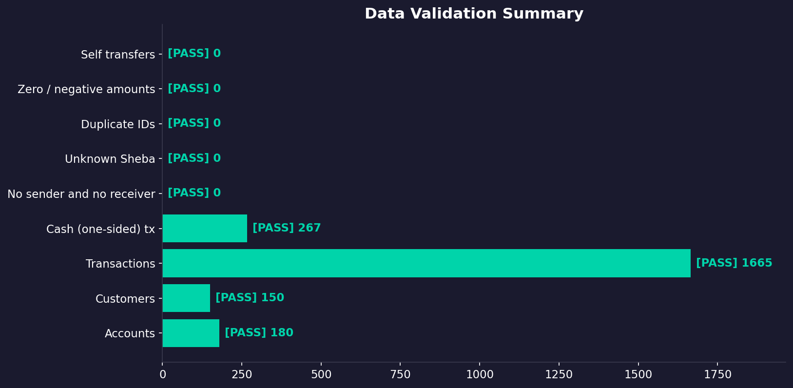

---

## ۴. مدل گرافی Neo4j

### ۴.۱ گره‌ها (Nodes)

| گره | تعداد |
|---|---|
| Bank | 10 |
| Customer | 150 |
| Customer:Person | 120 |
| Customer:Person:ForeignNational | 9 |
| Customer:Company | 30 |
| Account | 180 |
| Transaction | 1665 |

### ۴.۲ روابط (Relationships)

| رابطه | جهت | تعداد |
|---|---|---|
| OWNS_ACCOUNT | Customer → Account | 217 |
| BELONGS_TO_BANK | Account → Bank | 180 |
| SENT | Account → Transaction | 1526 |
| RECEIVED | Transaction → Account | 1537 |

واریز نقدی فقط رابطه RECEIVED و برداشت نقدی فقط رابطه SENT دارد.

### ۴.۳ نمای کلی گراف

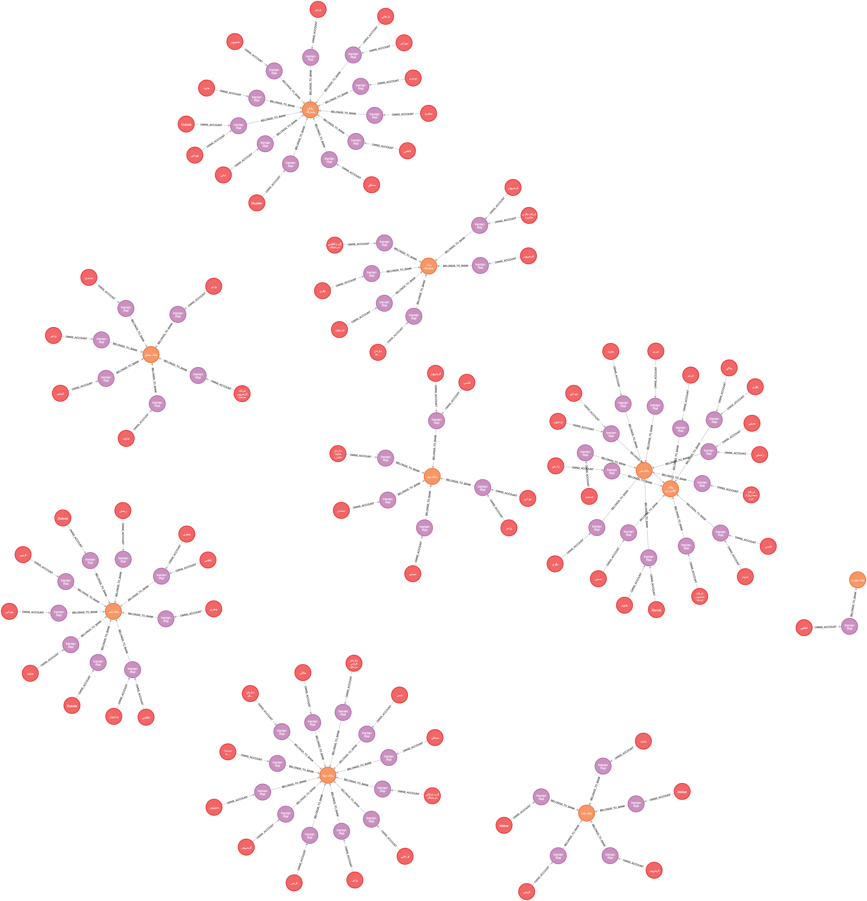

---

## ۵. خلاصه سناریوهای تقلب

| # | نام سناریو | تراکنش | کاشته‌شده | بازه | الگو |
|---|---|---|---|---|---|
| 01 | لایه‌گذاری ساده (Simple Layering) | 135 | 15 | 14030101–14030204 | نقد → A→B→C→D → نقد (۳ دور) |
| 02 | خرد کردن تراکنش (Structuring / Smurfing) | 181 | 31 | 14030101–14030204 | ۱۵ واریز نقدی زیر سقف → حساب تجمیع‌کننده |
| 03 | شبکه شرکت‌های کاغذی (Shell Company Network) | 132 | 12 | 14030101–14030215 | A→B→C→A (۴ چرخه) |
| 04 | تامین مالی تروریسم (Terrorist Financing) | 354 | 104 | 14030101–14030306 | ۵۰ اهداکننده → خیریه → NGO → تبعه خارجی |
| 05 | تصاحب حساب (Account Takeover) | 181 | 4 | 14030101–14030631 | ۶ ماه رفتار عادی، سپس تخلیه شبانه |
| 06 | پولشویی مبتنی بر تجارت (Trade-Based ML) | 160 | 10 | 14030101–14030328 | واردکننده → کارگزار (۱۵٪−) → تبعه خارجی (۵ چرخه) |
| 07 | تقلب کارمند بانک (Insider Fraud) | 132 | 12 | 14030101–14030204 | حساب‌های راکد یک شعبه → حساب‌های واسط → نقد |
| 08 | پرداخت‌های دایره‌ای (Circular Payments) | 224 | 24 | 14030101–14030224 | حلقه ۱۸ حسابی تا مبدا + ۳ مسیر فرعی |
| 09 | پخش و تجمیع (Scatter-Gather) | 166 | 16 | 14030101–14030130 | یک مبدا → ۷ واسط → یک جمع‌کننده |

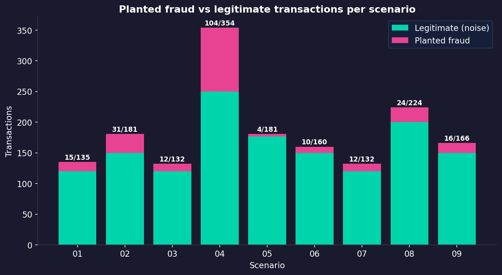

---

## 6. سناریوی 01: لایه‌گذاری ساده (Simple Layering)

### 6.1 توضیح سناریو

وجه نقد با مبلغی کمی پایین‌تر از سقف گزارش‌دهی به یک حساب تازه‌افتتاح‌شده واریز می‌شود، ظرف حدود ۴ روز کاری از سه حساب حقیقی دیگر عبور می‌کند (در هر گام ۵۰۰ هزار ریال کم می‌شود) و در پایان به‌صورت نقدی برداشت می‌گردد. این چرخه سه بار با مبالغ ۴۵، ۴۸٫۵ و ۴۲ میلیون ریال تکرار شده است.

**آمار:**

- الگو: نقد → A→B→C→D → نقد (۳ دور)
- تعداد تراکنش: 135
- تراکنش کاشته‌شده: 15
- تراکنش عادی: 120
- حجم تراکنش‌های کاشته‌شده: 654M IRR
- بازه: 14030101 تا 14030204
- نقش‌ها: placement (3), layering (9), integration (3)

### 6.2 نحوه پنهان‌سازی

- واریزهای نقدی و حقوق‌های قانونی در همین بازه مبلغ (تا حدود ۴۹٫۵ میلیون) وجود دارند
- چهار حساب زنجیره تراکنش‌های عادی هم دارند
- شرح تراکنش‌ها خالی یا معمولی است

### 6.3 نشانگرهای تقلب

- واریز نقدی زیر سقف و انتقال فوری همان مبلغ
- عبور سریع از چند حساب با کاهش تدریجی مبلغ
- حساب اول تازه افتتاح شده است
- برداشت نقدی در انتهای زنجیره

### 6.4 تصاویر

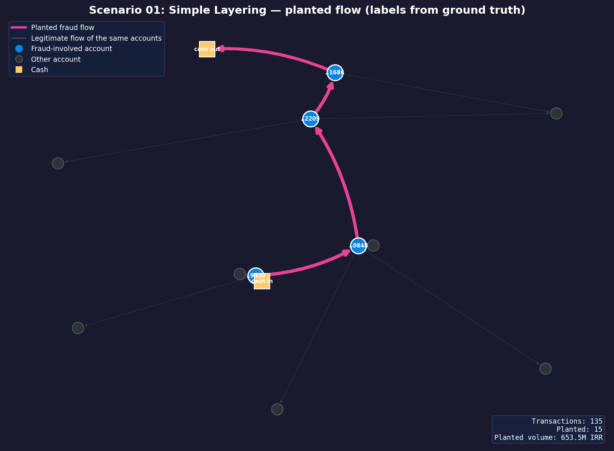

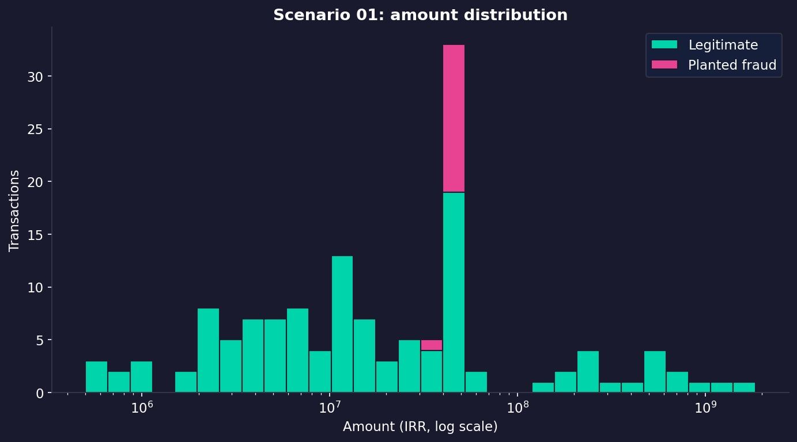

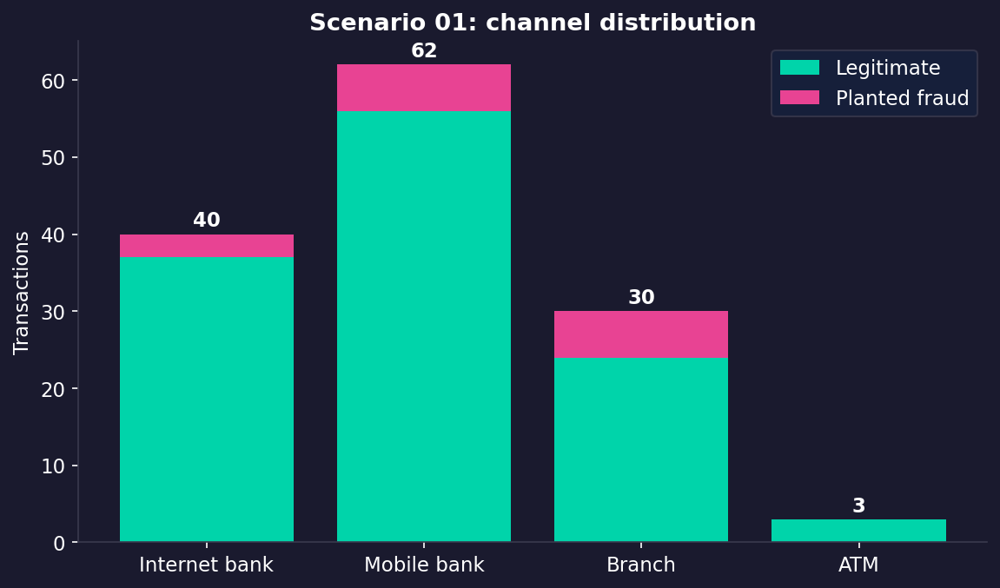

### 6.5 کوئری تشخیص

```cypher
MATCH p = (d:Transaction {scenario:'scenario_01', type:'واریز نقدی'})-[:RECEIVED]->(a:Account)
          -[:SENT]->(t1:Transaction {scenario:'scenario_01'})-[:RECEIVED]->(b:Account)
          -[:SENT]->(t2:Transaction {scenario:'scenario_01'})-[:RECEIVED]->(c:Account)
          -[:SENT]->(t3:Transaction {scenario:'scenario_01'})-[:RECEIVED]->(e:Account)
WHERE d.date <= t1.date < t2.date < t3.date
  AND 0.95 * d.amount  <= t1.amount <= d.amount
  AND 0.95 * t1.amount <= t2.amount <= t1.amount
  AND 0.95 * t2.amount <= t3.amount <= t2.amount
RETURN p
```

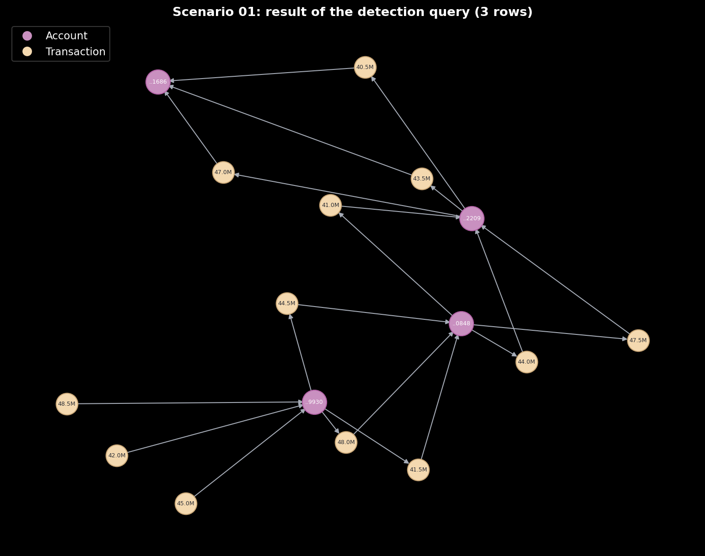

**نتیجه:** کوئری 12 تراکنش برگرداند که 12 مورد آن کاشته‌شده و 0 مورد مثبت کاذب است؛ پوشش 12 از 15 (80٪).

برداشت نقدی انتهای زنجیره (نقش integration) در مسیر بازگشتی کوئری نیست و با دنبال کردن حساب آخر به‌دست می‌آید.

---

## 7. سناریوی 02: خرد کردن تراکنش (Structuring / Smurfing)

### 7.1 توضیح سناریو

۹ حساب واسط در ۸ روز، ۱۵ واریز نقدی بین ۴۳ تا ۴۹٫۵ میلیون ریال (زیر سقف ۵۰ میلیونی) دریافت می‌کنند و هر واریز همان روز به یک حساب تجمیع‌کننده منتقل می‌شود. تجمیع‌کننده در روز دوازدهم حدود ۹۶٪ مجموع را در یک انتقال خارج می‌کند.

**آمار:**

- الگو: ۱۵ واریز نقدی زیر سقف → حساب تجمیع‌کننده
- تعداد تراکنش: 181
- تراکنش کاشته‌شده: 31
- تراکنش عادی: 150
- حجم تراکنش‌های کاشته‌شده: 2,081M IRR
- بازه: 14030101 تا 14030204
- نقش‌ها: structured_deposit (15), funnel_transfer (15), consolidation (1)

### 7.2 نحوه پنهان‌سازی

- مبالغ یکسان نیستند
- حقوق‌ها و واریزهای نقدی قانونی در همان بازه ۴۰ تا ۵۰ میلیون قرار دارند
- حساب‌های واسط فعالیت عادی هم دارند

### 7.3 نشانگرهای تقلب

- جفت «واریز نقدی / انتقال» در یک روز
- هم‌گرایی چند حساب به یک حساب
- انتقال تجمیعی اندکی بعد

### 7.4 تصاویر

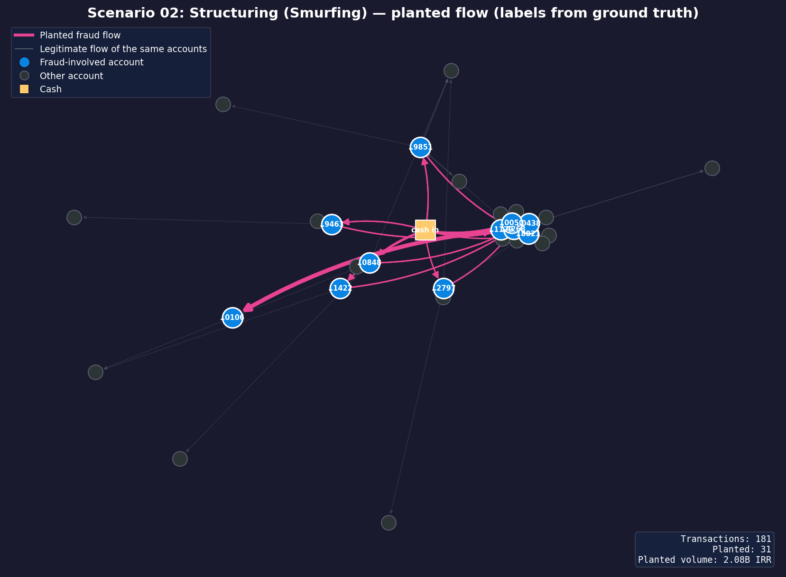

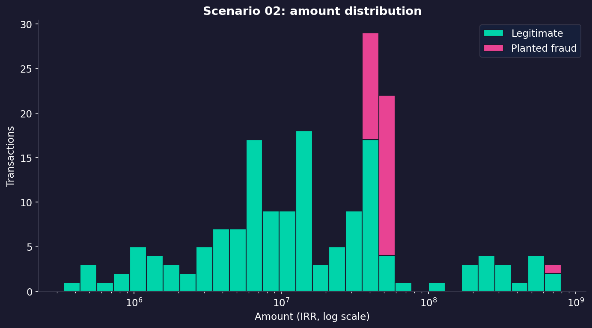

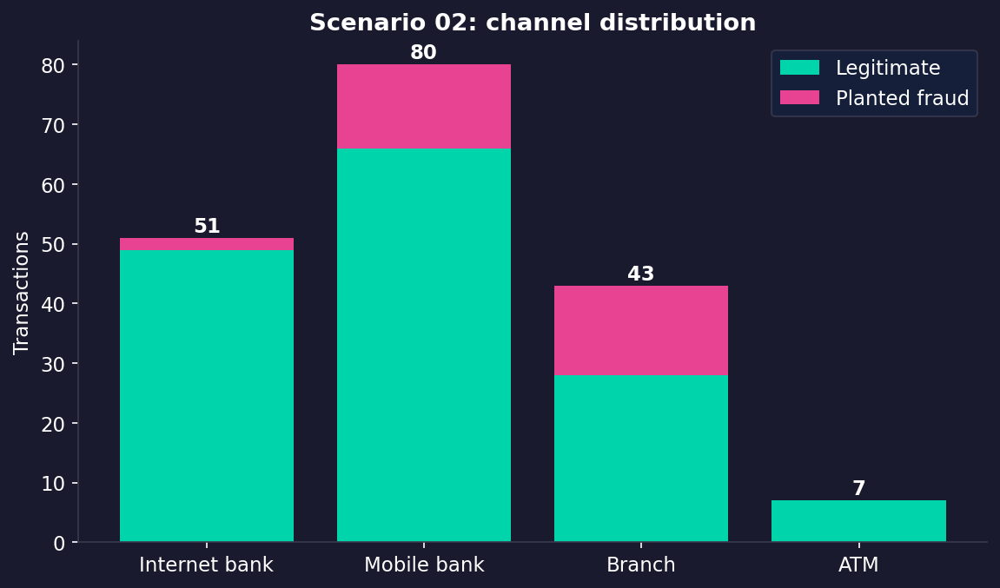

### 7.5 کوئری تشخیص

```cypher
MATCH p = (d:Transaction {scenario:'scenario_02', type:'واریز نقدی'})-[:RECEIVED]->(s:Account)
          -[:SENT]->(t:Transaction {scenario:'scenario_02'})-[:RECEIVED]->(agg:Account)
WHERE 40000000 <= d.amount < 50000000
  AND t.date = d.date AND 0.95 * d.amount <= t.amount <= d.amount
WITH agg, collect(p) AS paths, count(DISTINCT s) AS smurfs
WHERE smurfs >= 3
UNWIND paths AS p
RETURN p
```

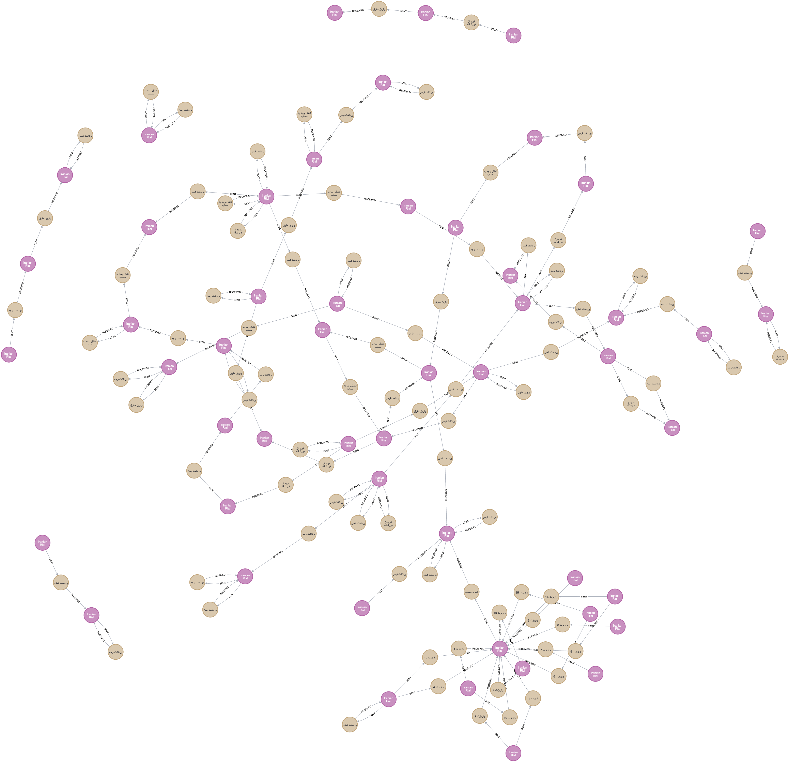

**نتیجه:** کوئری 30 تراکنش برگرداند که 30 مورد آن کاشته‌شده و 0 مورد مثبت کاذب است؛ پوشش 30 از 31 (97٪).

انتقال تجمیعی نهایی (consolidation) گام بعدیِ حساب تجمیع‌کننده است و در مسیر کوئری نیست.

---

## 8. سناریوی 03: شبکه شرکت‌های کاغذی (Shell Company Network)

### 8.1 توضیح سناریو

سه حساب حقوقی متعلق به سه مشتری متفاوت، در حدود ۶ هفته چهار بار وجوه را به‌صورت دایره‌ای بین خود می‌چرخانند. هر چرخه با ۴۲۰ تا ۵۶۰ میلیون ریال شروع می‌شود و در هر گام ۳ تا ۷ درصد کسر می‌گردد. شرح‌ها فاکتورهای متوالی با خدمات مبهم (مشاوره، مدیریت، بازرگانی) هستند.

**آمار:**

- الگو: A→B→C→A (۴ چرخه)
- تعداد تراکنش: 132
- تراکنش کاشته‌شده: 12
- تراکنش عادی: 120
- حجم تراکنش‌های کاشته‌شده: 5,250M IRR
- بازه: 14030101 تا 14030215
- نقش‌ها: round_trip (12)

### 8.2 نحوه پنهان‌سازی

- فاکتورهای B2B قانونی با همان سبک شرح و مبالغ مشابه (میانه حدود ۳۲۵ میلیون، برخی بالای ۱ میلیارد)
- چرخه‌های کوچک طبیعی در نویز وجود دارد که کوئری ساده چرخه را دچار مثبت کاذب می‌کند

### 8.3 نشانگرهای تقلب

- چرخه بسته سه‌تایی تکرارشونده بین همان شرکت‌ها
- کاهش مبلغ در هر گام
- شرح‌های مبهم

### 8.4 تصاویر

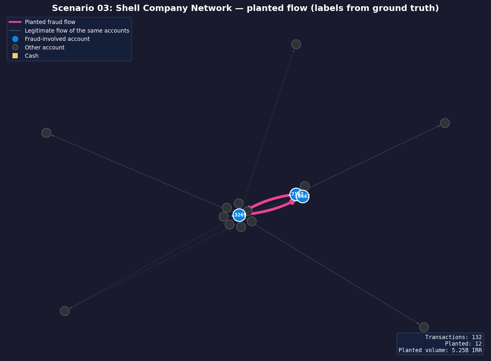

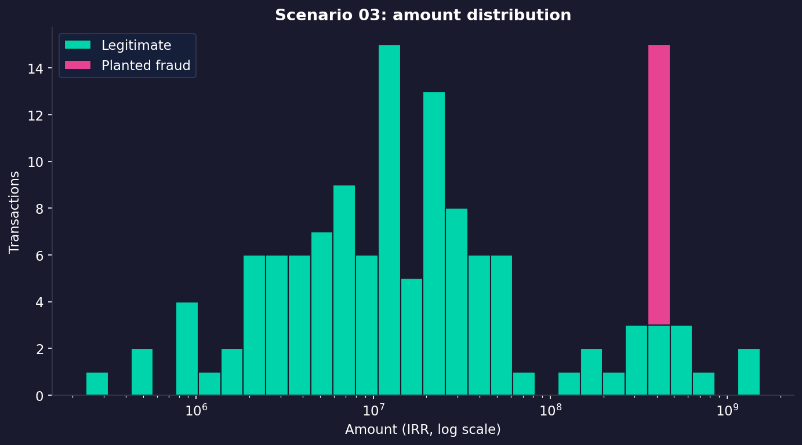

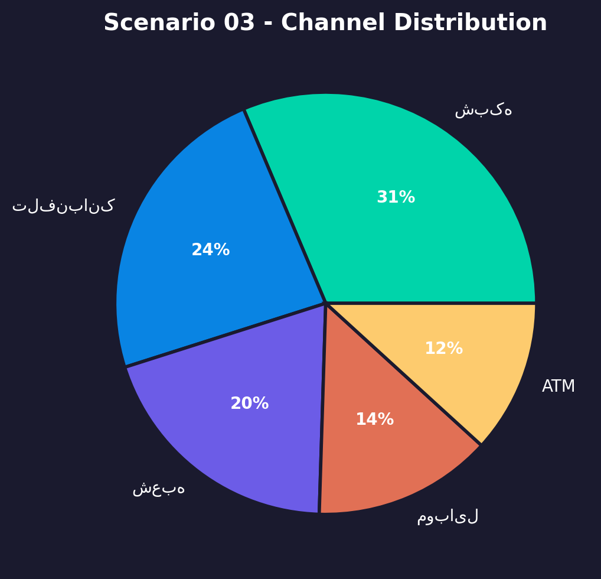

### 8.5 کوئری تشخیص

```cypher
MATCH p = (a:Account)-[:SENT]->(t1:Transaction {scenario:'scenario_03'})-[:RECEIVED]->(b:Account)
          -[:SENT]->(t2:Transaction {scenario:'scenario_03'})-[:RECEIVED]->(c:Account)
          -[:SENT]->(t3:Transaction {scenario:'scenario_03'})-[:RECEIVED]->(a)
WHERE a <> b AND b <> c AND a <> c
  AND t1.date < t2.date < t3.date
  AND 0.9 * t1.amount <= t2.amount <= t1.amount
  AND 0.9 * t2.amount <= t3.amount <= t2.amount
RETURN p
```

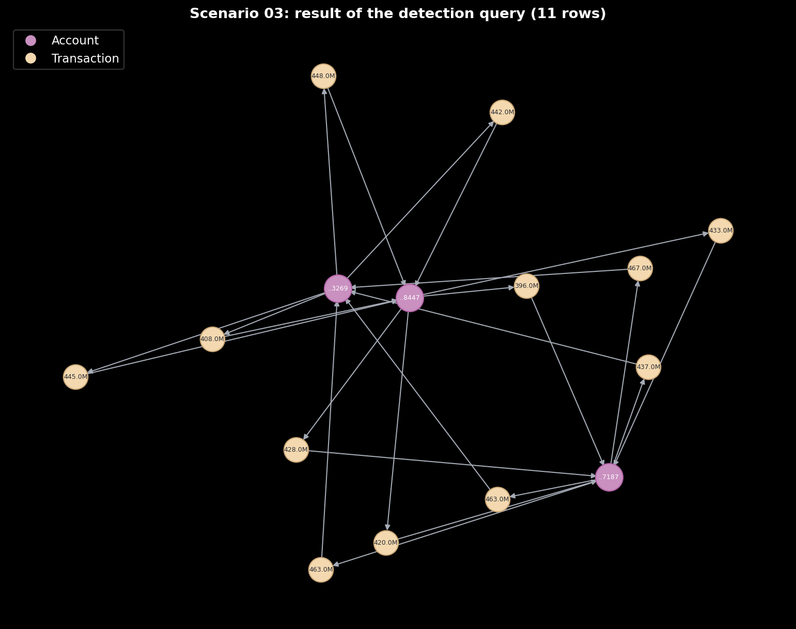

**نتیجه:** کوئری 12 تراکنش برگرداند که 12 مورد آن کاشته‌شده و 0 مورد مثبت کاذب است؛ پوشش 12 از 12 (100٪).

---

## 9. سناریوی 04: تامین مالی تروریسم (Terrorist Financing)

### 9.1 توضیح سناریو

۵۰ اهداکننده غیرحقوقی (شامل چند تبعه خارجی) طی ۶۰ روز هر کدام ۱ تا ۳ کمک ۱ تا ۵ میلیون ریالی به حساب یک موسسه خیریه واریز می‌کنند. خیریه در دو نوبت حدود ۹۵٪ وجوه جمع‌شده هر ماه را به یک NGO منتقل می‌کند و NGO دو روز بعد حدود ۹۰٪ آن را به حساب یک تبعه خارجی می‌فرستد.

**آمار:**

- الگو: ۵۰ اهداکننده → خیریه → NGO → تبعه خارجی
- تعداد تراکنش: 354
- تراکنش کاشته‌شده: 104
- تراکنش عادی: 250
- حجم تراکنش‌های کاشته‌شده: 732M IRR
- بازه: 14030101 تا 14030306
- نقش‌ها: donation (100), aggregation (2), foreign_transfer (2)

### 9.2 نحوه پنهان‌سازی

- فروشگاه‌های قانونی هم پرداخت‌های کوچک زیادی از افراد مختلف دریافت می‌کنند
- شرح کمک‌ها عادی است (کمک خیریه، نذر یا خالی)

### 9.3 نشانگرهای تقلب

- هم‌گرایی تعداد زیادی واریز کوچک و عبور سریع
- خیریه وجوه را نگه نمی‌دارد
- ذی‌نفع نهایی تبعه خارجی است

### 9.4 تصاویر

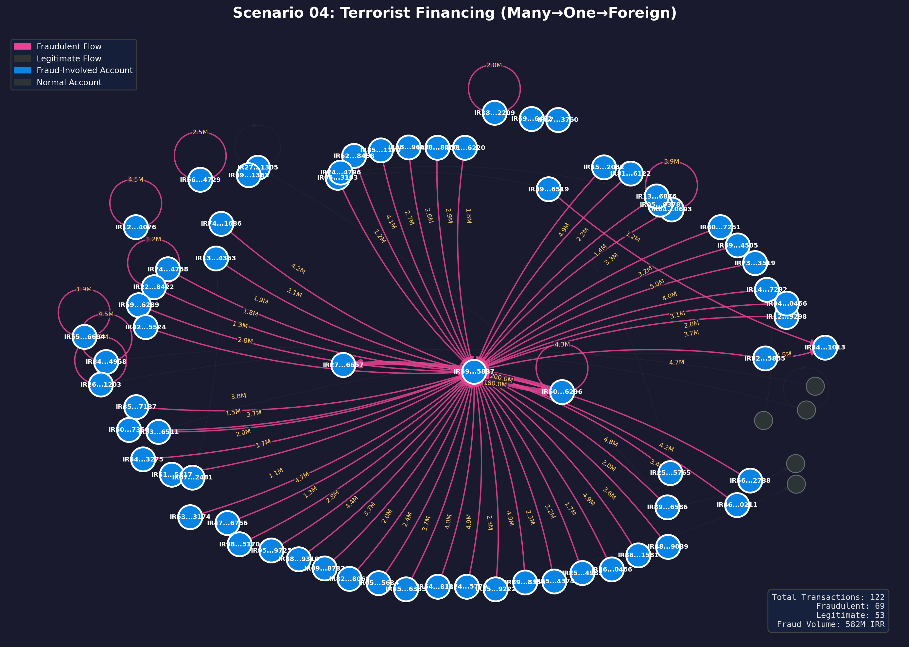

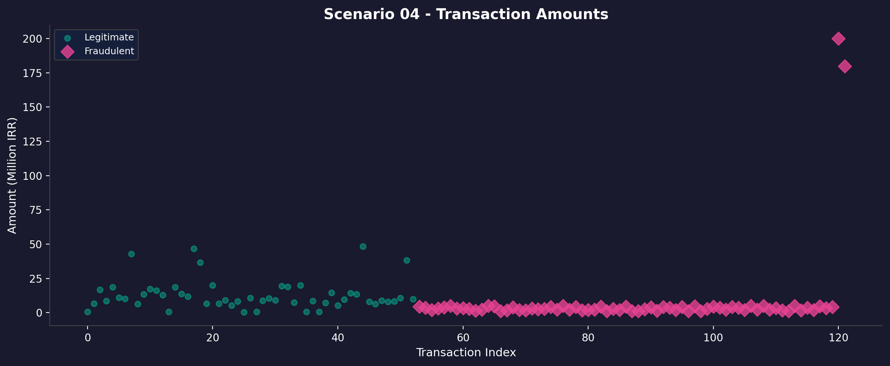

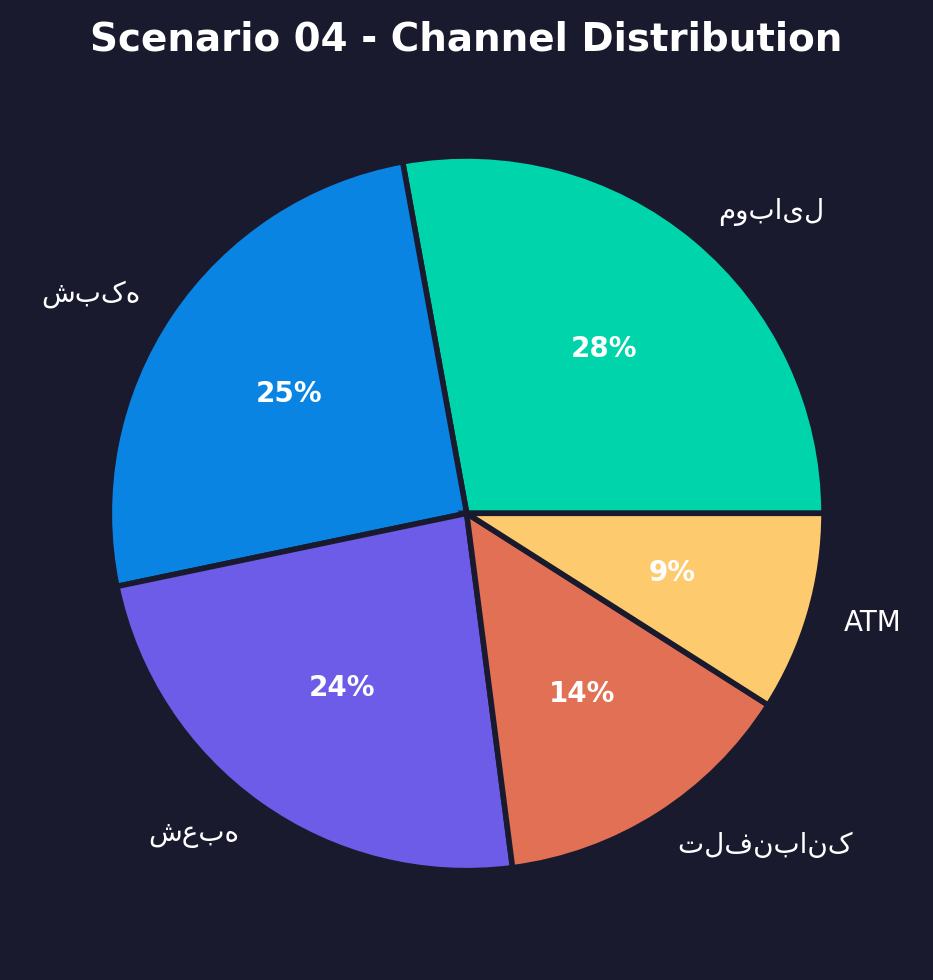

### 9.5 کوئری تشخیص

```cypher
MATCH (donor:Account)-[:SENT]->(d:Transaction {scenario:'scenario_04'})-[:RECEIVED]->(hub:Account)
WHERE d.amount <= 5000000
WITH hub, count(DISTINCT donor) AS donors, sum(d.amount) AS collected
WHERE donors >= 20
MATCH p = (hub)-[:SENT]->(t1:Transaction {scenario:'scenario_04'})-[:RECEIVED]->(mid:Account)
          -[:SENT]->(t2:Transaction {scenario:'scenario_04'})-[:RECEIVED]->(dst:Account)
WHERE (dst)<-[:OWNS_ACCOUNT]-(:ForeignNational)
  AND t1.date <= t2.date
  AND t1.amount >= 0.2 * collected AND 0.8 * t1.amount <= t2.amount <= t1.amount
MATCH q = (:Account)-[:SENT]->(d2:Transaction {scenario:'scenario_04'})-[:RECEIVED]->(hub)
WHERE d2.amount <= 5000000
RETURN p, collect(q) AS donations
```

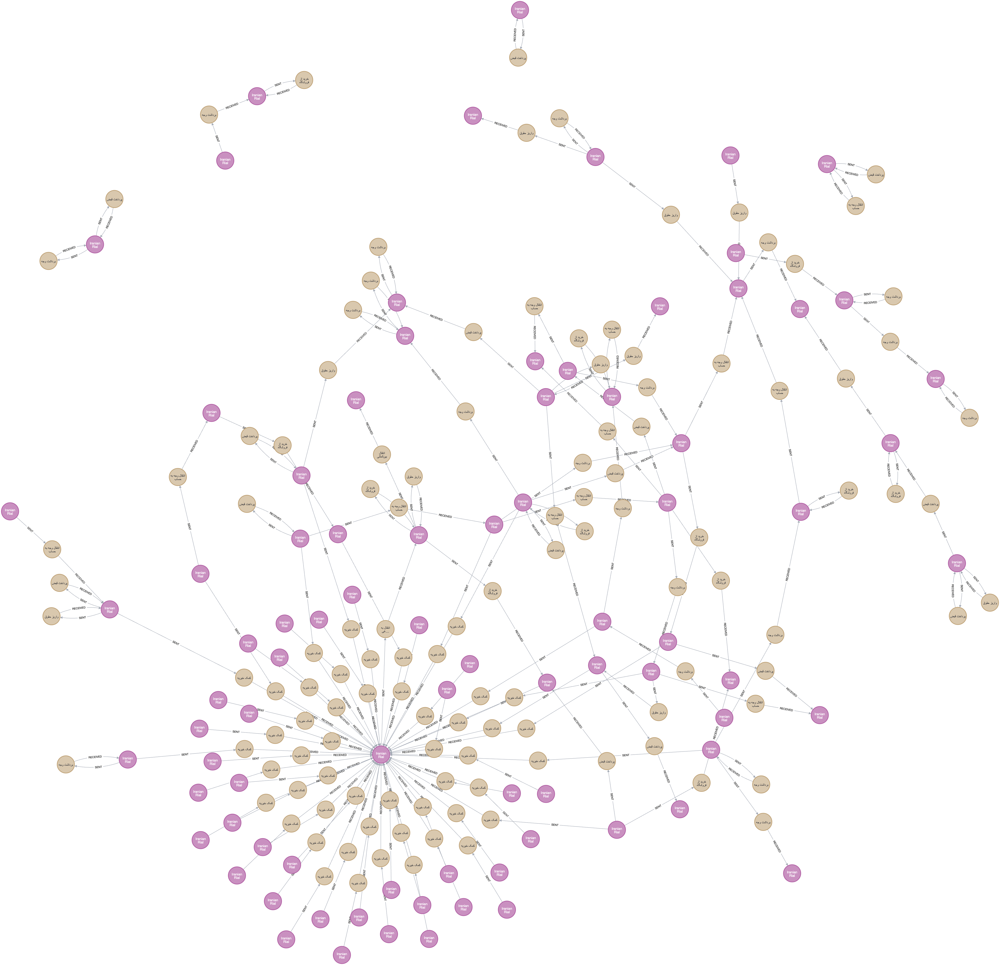

**نتیجه:** کوئری 104 تراکنش برگرداند که 104 مورد آن کاشته‌شده و 0 مورد مثبت کاذب است؛ پوشش 104 از 104 (100٪).

---

## 10. سناریوی 05: تصاحب حساب (Account Takeover)

### 10.1 توضیح سناریو

حساب یک بازنشسته (افتتاح پیش از ۱۳۹۵) شش ماه رفتار ثابتی دارد: واریز ماهانه ۲۵ میلیون ریال حقوق بازنشستگی، چند خرید کوچک و یک برداشت از خودپرداز. سپس در ساعات ۰ تا ۵ بامداد و از طریق موبایل‌بانک، ۵۰۰ میلیون ریال به یک حساب تازه‌افتتاح‌شده و طی ۴ روز بعد ۲۰۰، ۱۸۰ و ۱۵۰ میلیون به ذی‌نفع دیگری منتقل می‌شود.

**آمار:**

- الگو: ۶ ماه رفتار عادی، سپس تخلیه شبانه
- تعداد تراکنش: 181
- تراکنش کاشته‌شده: 4
- تراکنش عادی: 177
- حجم تراکنش‌های کاشته‌شده: 1,030M IRR
- بازه: 14030101 تا 14030631
- نقش‌ها: takeover_transfer (1), drain (3)

### 10.2 نحوه پنهان‌سازی

- در جمعیت، انتقال‌های شخصی قانونی ۱۵۰ تا ۶۰۰ میلیونی (خودرو، ودیعه مسکن) وجود دارد
- رفتار پایه قربانی برچسب نخورده است

### 10.3 نشانگرهای تقلب

- مبلغ حدود ۲۰ برابر رفتار معمول حساب
- ساعت غیرعادی (بامداد)
- ذی‌نفعان جدید

### 10.4 تصاویر

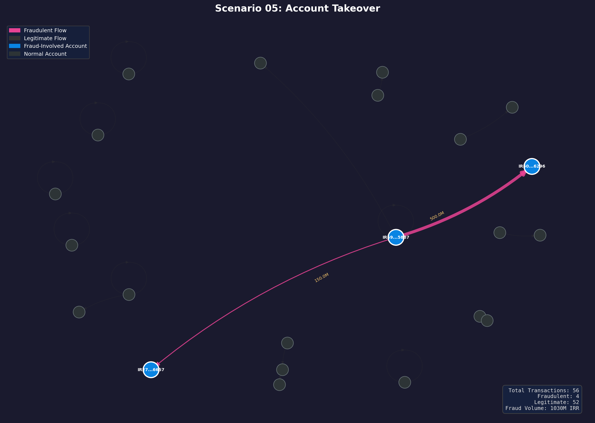

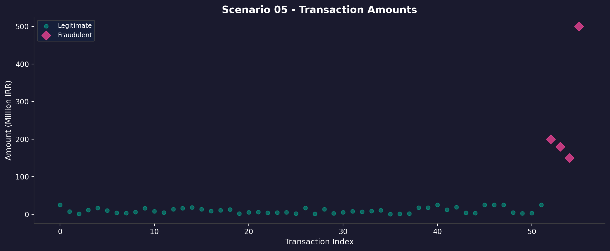

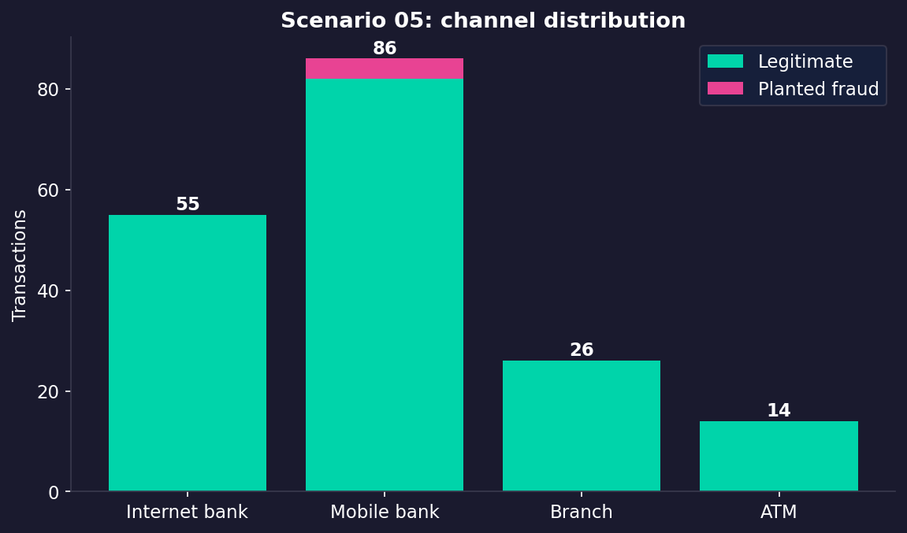

### 10.5 کوئری تشخیص

```cypher
MATCH (a:Account)-[:SENT]->(t:Transaction {scenario:'scenario_05'})
WITH a, percentileCont(t.amount, 0.5) AS typical
MATCH p = (a)-[:SENT]->(x:Transaction {scenario:'scenario_05'})-[:RECEIVED]->(:Account)
WHERE x.amount >= 20 * typical AND x.time < '060000'
RETURN p
```

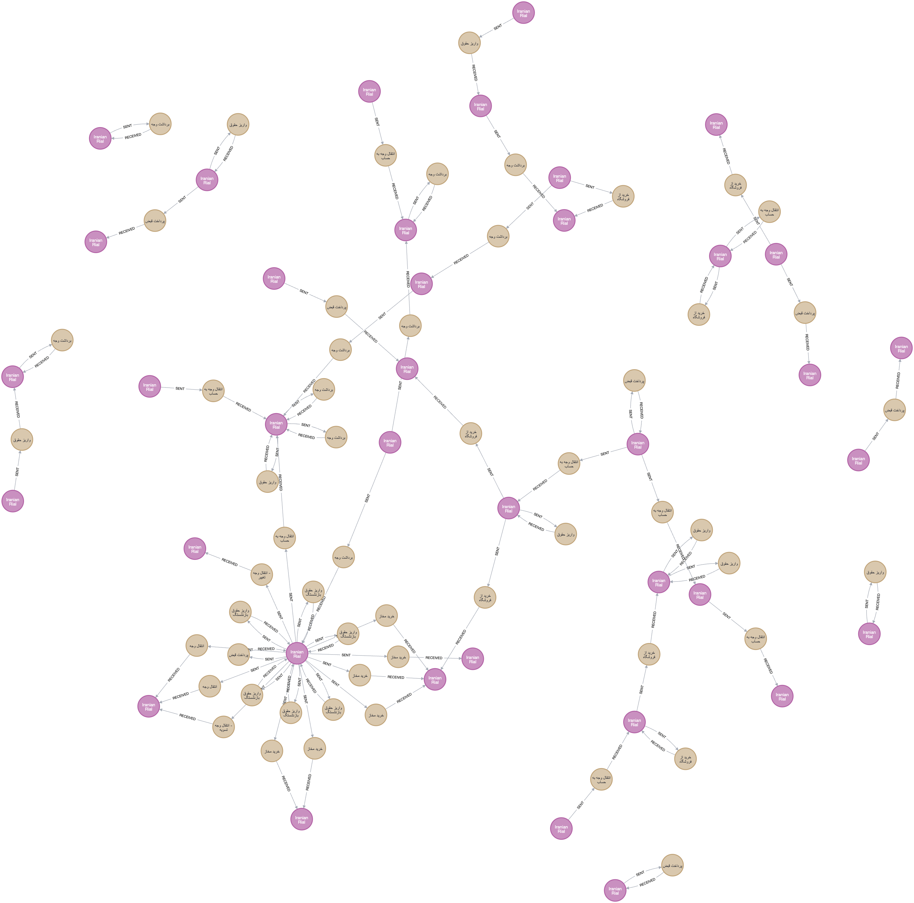

**نتیجه:** کوئری 4 تراکنش برگرداند که 4 مورد آن کاشته‌شده و 0 مورد مثبت کاذب است؛ پوشش 4 از 4 (100٪).

---

## 11. سناریوی 06: پولشویی مبتنی بر تجارت (Trade-Based ML)

### 11.1 توضیح سناریو

یک شرکت واردکننده هر حدود ۲۰ روز ۰٫۹ تا ۱٫۲ میلیارد ریال بابت پروفرما به یک کارگزار می‌پردازد و کارگزار ۱ تا ۳ روز بعد حدود ۸۵٪ آن را به حساب یک تبعه خارجی منتقل می‌کند. خودِ بیش‌اظهاری در داده پرداخت دیده نمی‌شود (به اظهارنامه گمرکی نیاز دارد)؛ آنچه دیده می‌شود عبور تکرارشونده با نگهداشت ثابت حدود ۱۵٪ است.

**آمار:**

- الگو: واردکننده → کارگزار (۱۵٪−) → تبعه خارجی (۵ چرخه)
- تعداد تراکنش: 160
- تراکنش کاشته‌شده: 10
- تراکنش عادی: 150
- حجم تراکنش‌های کاشته‌شده: 9,626M IRR
- بازه: 14030101 تا 14030328
- نقش‌ها: inflated_invoice (5), pass_through (5)

### 11.2 نحوه پنهان‌سازی

- پرداخت‌های B2B قانونی با مبالغ مشابه (برخی بالای ۱ میلیارد)
- شرح‌ها به سبک پروفرمای عادی است

### 11.3 نشانگرهای تقلب

- نسبت نگهداشت ثابت
- سه طرف ثابت و آهنگ منظم
- ذی‌نفع نهایی تبعه خارجی

### 11.4 تصاویر

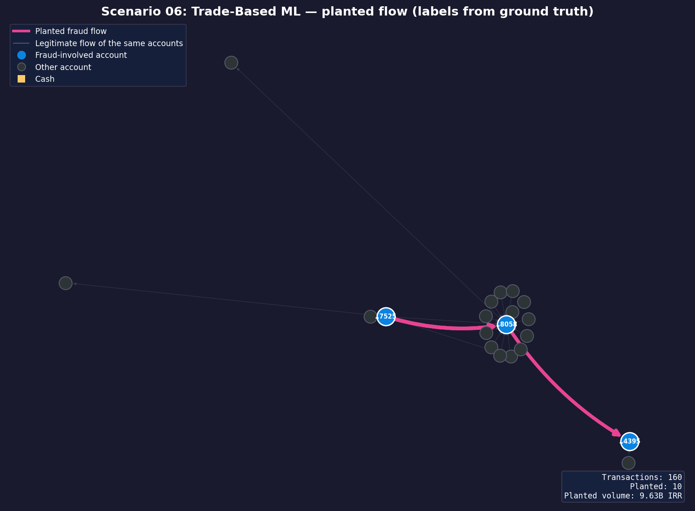

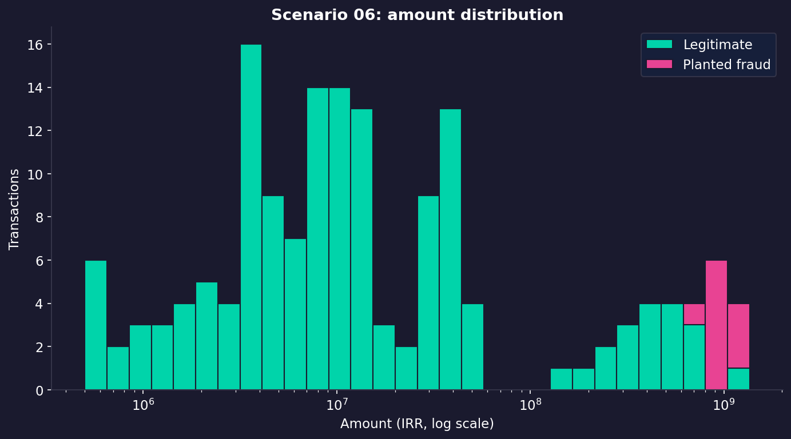


### 11.5 کوئری تشخیص

```cypher
MATCH p = (imp:Account)-[:SENT]->(t1:Transaction {scenario:'scenario_06'})-[:RECEIVED]->(broker:Account)
          -[:SENT]->(t2:Transaction {scenario:'scenario_06'})-[:RECEIVED]->(exp:Account)
WHERE (exp)<-[:OWNS_ACCOUNT]-(:ForeignNational)
  AND t1.amount >= 500000000
  AND t1.date < t2.date
  AND 0.80 * t1.amount <= t2.amount <= 0.90 * t1.amount
RETURN p
```

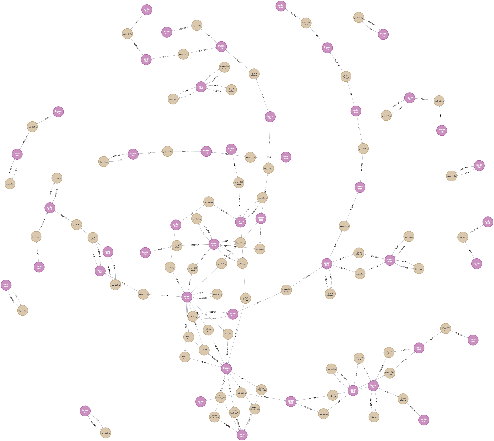

**نتیجه:** کوئری 10 تراکنش برگرداند که 10 مورد آن کاشته‌شده و 0 مورد مثبت کاذب است؛ پوشش 10 از 10 (100٪).

---

## 12. سناریوی 07: تقلب کارمند بانک (Insider Fraud)

### 12.1 توضیح سناریو

۶ حساب حقیقی قدیمی (افتتاح پیش از ۱۳۹۸) که همگی به یک بانک و یک شعبه تعلق دارند و هیچ فعالیت دیگری ندارند، تقریباً هر ۳ روز یک‌بار ۵۰ تا ۲۰۰ میلیون ریال را از طریق باجه شعبه به ۴ حساب واسط منتقل می‌کنند. حساب واسط ظرف ۱ تا ۲ روز ۸۵ تا ۹۵٪ مبلغ را نقد برداشت می‌کند.

**آمار:**

- الگو: حساب‌های راکد یک شعبه → حساب‌های واسط → نقد
- تعداد تراکنش: 132
- تراکنش کاشته‌شده: 12
- تراکنش عادی: 120
- حجم تراکنش‌های کاشته‌شده: 1,044M IRR
- بازه: 14030101 تا 14030204
- نقش‌ها: unauthorized_transfer (6), cash_out (6)

### 12.2 نحوه پنهان‌سازی

- قربانیان به‌جز این انتقال ساکت‌اند و در نویز دیده نمی‌شوند
- حساب‌های واسط فعالیت عادی دارند

### 12.3 نشانگرهای تقلب

- حساب راکد که ناگهان فعال می‌شود
- اشتراک شعبه بین همه قربانیان
- ذی‌نفعان مشترک
- برداشت نقدی سریع

### 12.4 تصاویر

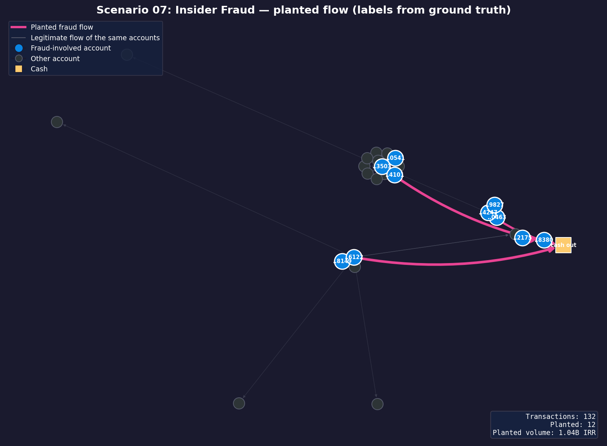

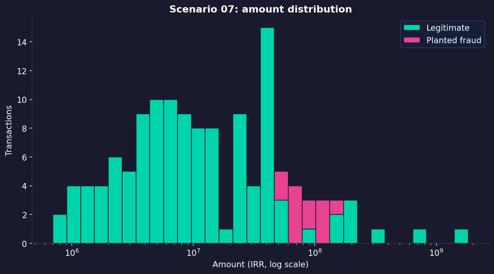

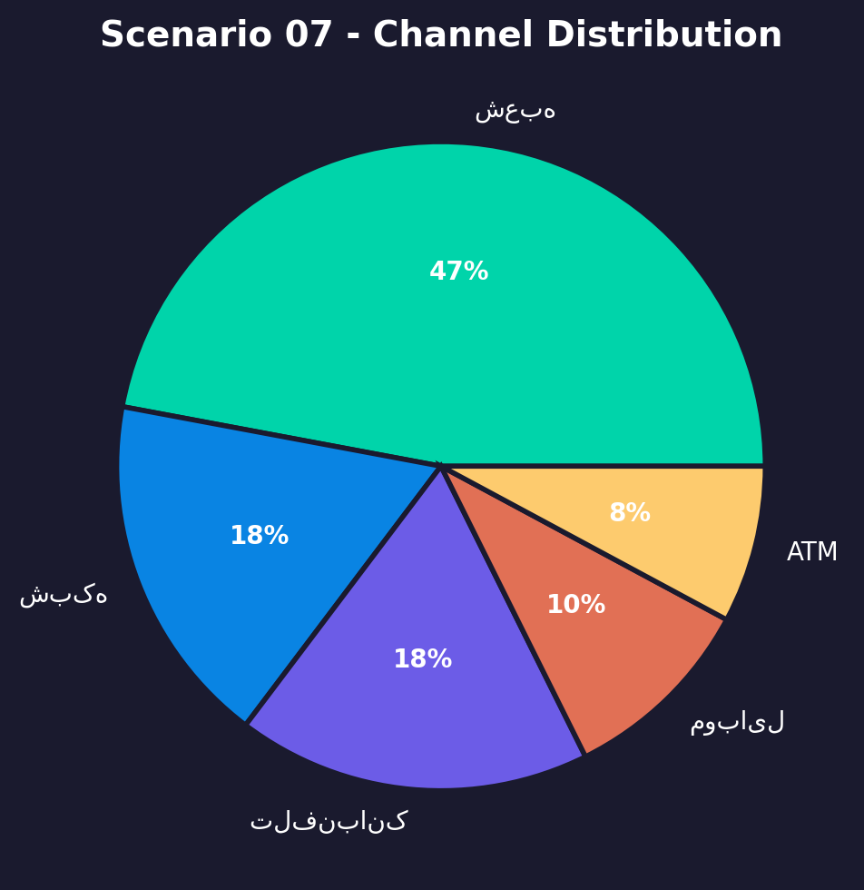

### 12.5 کوئری تشخیص

```cypher
MATCH p = (v:Account)-[:SENT]->(t:Transaction {scenario:'scenario_07', channel:'شعبه'})-[:RECEIVED]->(m:Account)
WHERE t.amount >= 50000000
  AND NOT EXISTS { (v)-[:SENT]->(o:Transaction {scenario:'scenario_07'}) WHERE o <> t }
  AND NOT EXISTS { (:Transaction {scenario:'scenario_07'})-[:RECEIVED]->(v) }
WITH v.bank_code AS bank, v.branch_code AS branch, collect(p) AS paths
WHERE size(paths) >= 3
UNWIND paths AS p
RETURN p
```

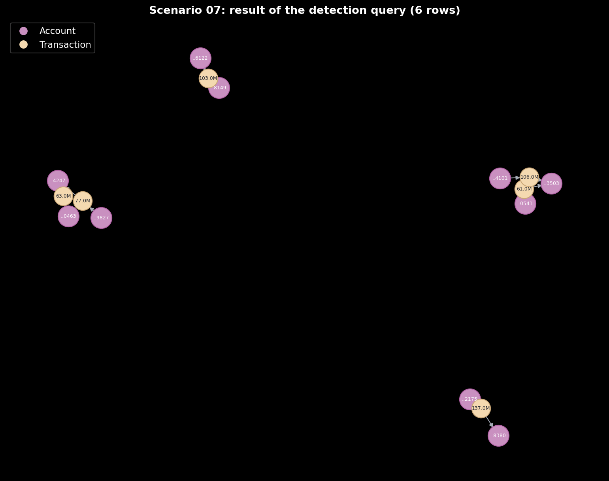

**نتیجه:** کوئری 6 تراکنش برگرداند که 6 مورد آن کاشته‌شده و 0 مورد مثبت کاذب است؛ پوشش 6 از 12 (50٪).

برداشت‌های نقدی حساب‌های واسط (cash_out) گام بعدی هستند و در مسیر کوئری نیستند.

---

## 13. سناریوی 08: پرداخت‌های دایره‌ای (Circular Payments)

### 13.1 توضیح سناریو

وجهی حدود ۱ میلیارد ریال از طریق ۱۸ حساب، با فاصله ۱ تا ۴ روز کاری بین هر گام (حدود ۷ هفته) و کسر ۴ تا ۶ درصد در هر گام، به حساب مبدا بازمی‌گردد (حدود ۴۱۶ میلیون). سه مسیر فرعی ۲۰۰ میلیونی نیز از مبدا جدا شده و دوباره به حلقه می‌پیوندند.

**آمار:**

- الگو: حلقه ۱۸ حسابی تا مبدا + ۳ مسیر فرعی
- تعداد تراکنش: 224
- تراکنش کاشته‌شده: 24
- تراکنش عادی: 200
- حجم تراکنش‌های کاشته‌شده: 12,730M IRR
- بازه: 14030101 تا 14030224
- نقش‌ها: ring_hop (18), side_path (6)

### 13.2 نحوه پنهان‌سازی

- شرح‌ها خالی است
- تمام حساب‌های حلقه فعالیت عادی هم دارند

### 13.3 نشانگرهای تقلب

- چرخه طولانی که به مبدا برمی‌گردد
- کاهش یکنواخت مبلغ
- مسیرهای فرعی هم‌گرا

### 13.4 تصاویر

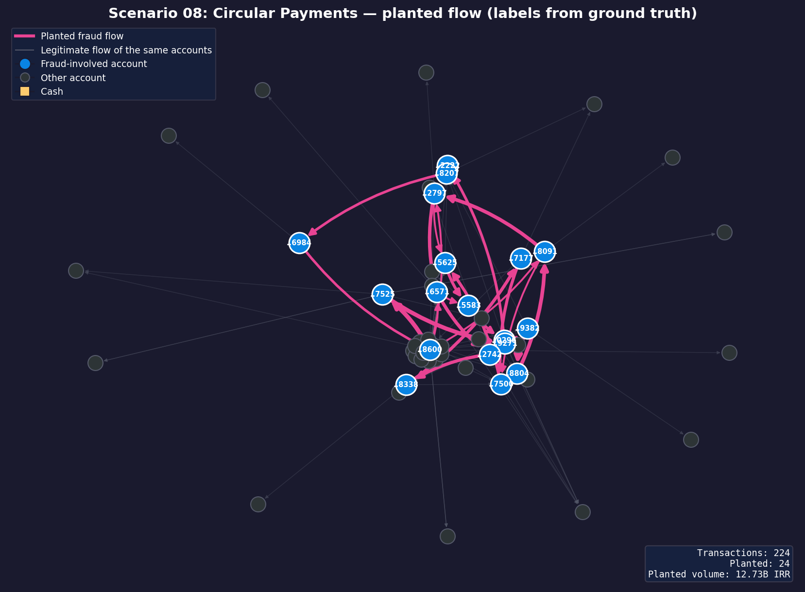

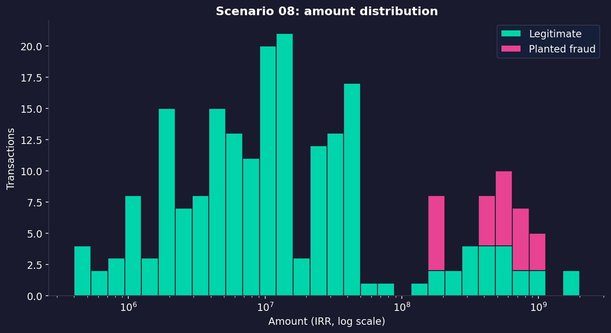

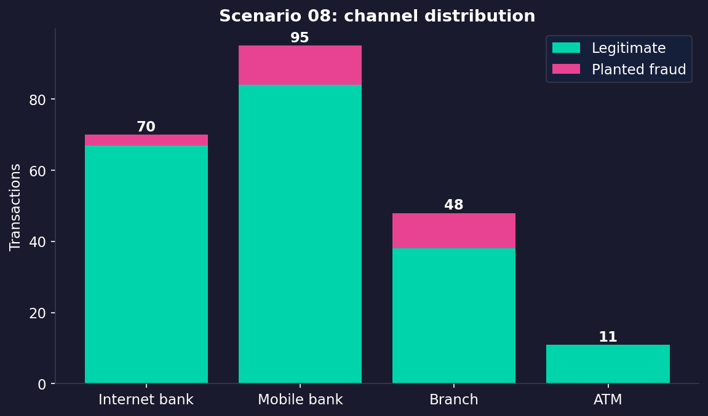

### 13.5 کوئری تشخیص

```cypher
MATCH p = (a:Account)
          ((:Account)-[:SENT]->(t:Transaction {scenario:'scenario_08'} WHERE t.amount >= 300000000)-[:RECEIVED]->(:Account)){3,20}
          (a)
WHERE all(i IN range(0, size(t) - 2)
          WHERE t[i].date < t[i+1].date AND 0.9 * t[i].amount <= t[i+1].amount <= t[i].amount)
RETURN p
```

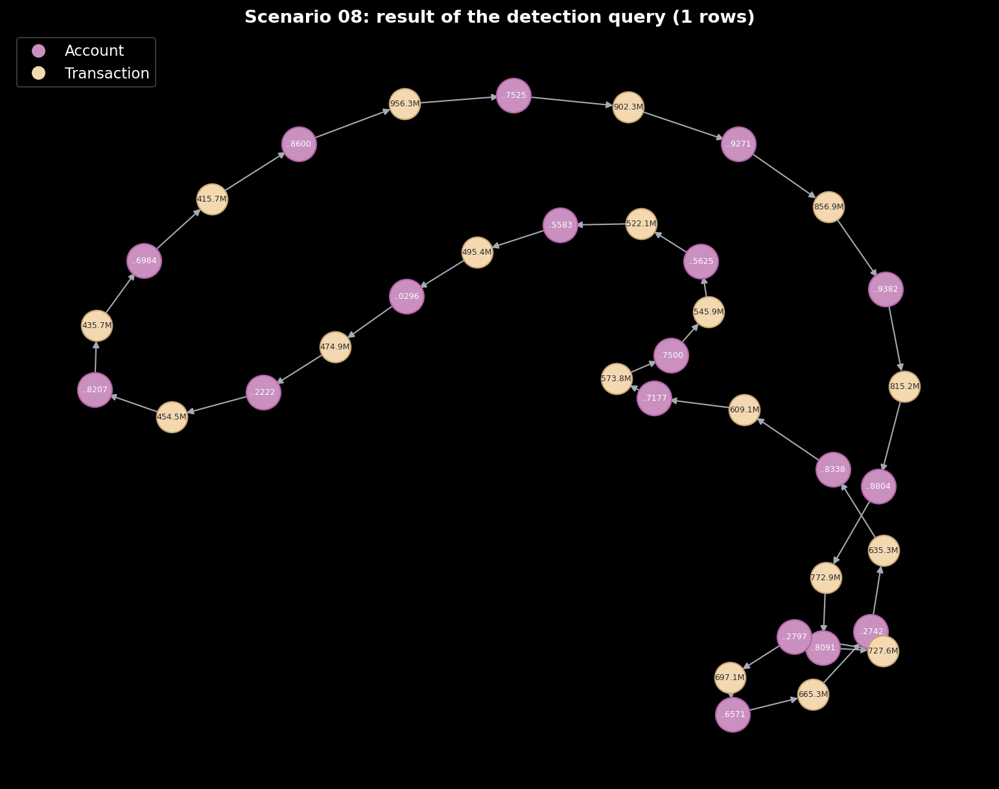

**نتیجه:** کوئری 18 تراکنش برگرداند که 18 مورد آن کاشته‌شده و 0 مورد مثبت کاذب است؛ پوشش 18 از 24 (75٪).

جستجوی چرخه طولانی بدون قید در Cypher انفجار ترکیبیاتی دارد؛ این کوئری با محدود کردن به تراکنش‌های حداقل ۳۰۰ میلیونی قابل اجرا شده و مسیرهای فرعی ۲۰۰ میلیونی (side_path) را نمی‌بیند.

---

## 14. سناریوی 09: پخش و تجمیع (Scatter-Gather)

### 14.1 توضیح سناریو

یک حساب مبدا ظرف ۳ روز به ۷ حساب حقیقی هر کدام ۲۸ تا ۵۹ میلیون ریال می‌فرستد. دو شاخه از یک واسط دوم هم عبور می‌کنند. هر شاخه ظرف ۱ تا ۴ روز ۹۵ تا ۹۹٪ دریافتی خود را به یک حساب جمع‌کننده مشترک منتقل می‌کند.

**آمار:**

- الگو: یک مبدا → ۷ واسط → یک جمع‌کننده
- تعداد تراکنش: 166
- تراکنش کاشته‌شده: 16
- تراکنش عادی: 150
- حجم تراکنش‌های کاشته‌شده: 690M IRR
- بازه: 14030101 تا 14030130
- نقش‌ها: scatter (7), relay (2), gather (7)

### 14.2 نحوه پنهان‌سازی

- هر مبلغ در بازه انتقال‌های شخصی عادی است
- شرح‌ها خالی است
- مبدا، واسط‌ها و جمع‌کننده فعالیت عادی هم دارند

### 14.3 نشانگرهای تقلب

- پخش و سپس هم‌گرایی بین همان دو حساب
- عبور تقریباً کامل وجه
- زمان نگهداری کوتاه

### 14.4 تصاویر

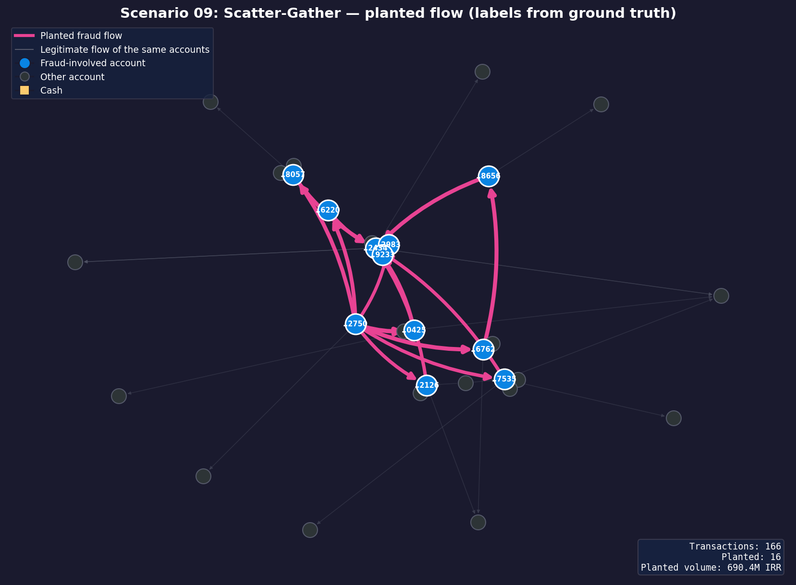

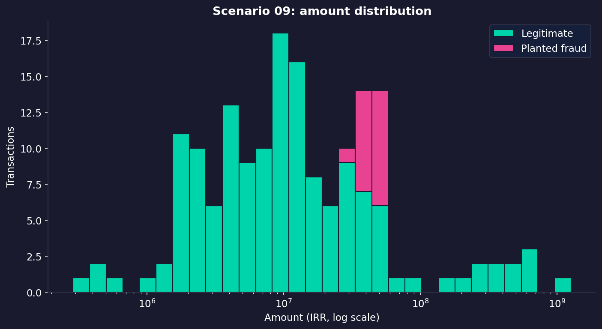

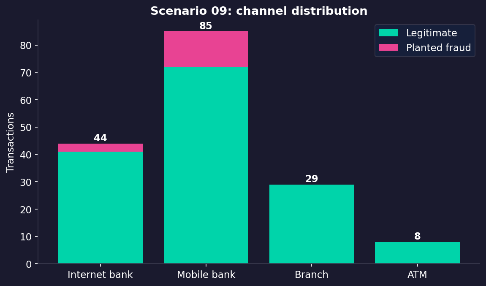

### 14.5 کوئری تشخیص

```cypher
MATCH p = (s:Account)-[:SENT]->(t1:Transaction {scenario:'scenario_09'})-[:RECEIVED]->(m:Account)
          -[:SENT]->(t2:Transaction {scenario:'scenario_09'})-[:RECEIVED]->(g:Account)
WHERE s <> g AND t1.date < t2.date
  AND 0.8 * t1.amount <= t2.amount <= t1.amount
WITH s, g, collect(p) AS paths, count(DISTINCT m) AS branches
WHERE branches >= 3
UNWIND paths AS p
RETURN p
```

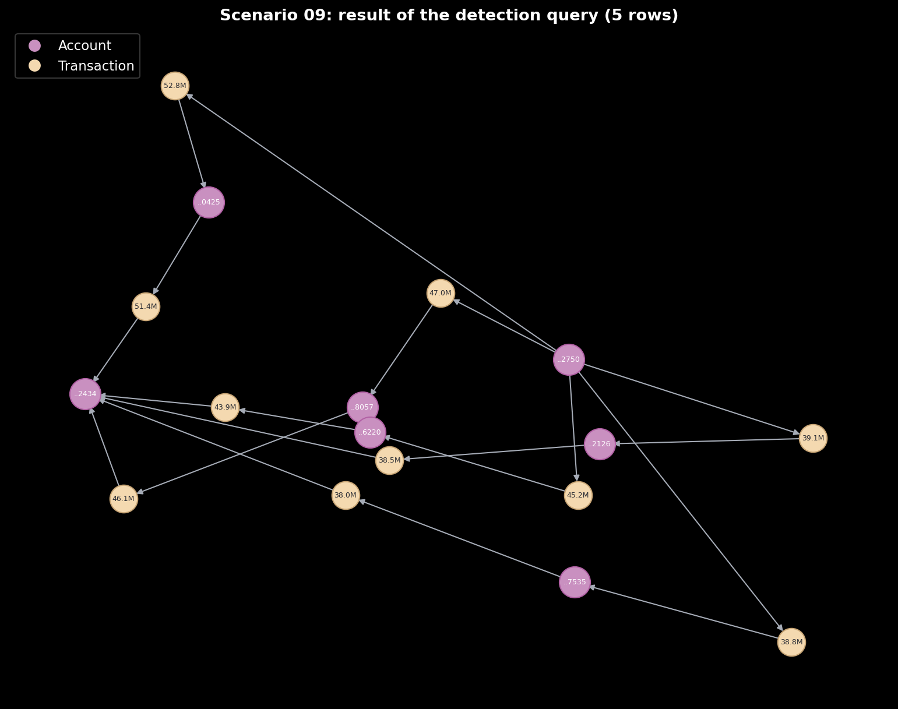

**نتیجه:** کوئری 10 تراکنش برگرداند که 10 مورد آن کاشته‌شده و 0 مورد مثبت کاذب است؛ پوشش 10 از 16 (62٪).

کوئری Cypher فقط شاخه‌های تک‌واسطه را می‌بیند (۵ از ۷). دو شاخه دوواسطه‌ای توسط API بخش ۱۶ پیدا می‌شوند که عمق متغیر را پشتیبانی می‌کند.

---

## 15. نتایج تشخیص

| # | سناریو | برگشتی | درست | مثبت کاذب | کاشته‌شده | پوشش |
|---|---|---|---|---|---|---|
| 01 | لایه‌گذاری ساده (Simple Layering) | 12 | 12 | 0 | 15 | 80٪ |
| 02 | خرد کردن تراکنش (Structuring / Smurfing) | 30 | 30 | 0 | 31 | 97٪ |
| 03 | شبکه شرکت‌های کاغذی (Shell Company Network) | 12 | 12 | 0 | 12 | 100٪ |
| 04 | تامین مالی تروریسم (Terrorist Financing) | 104 | 104 | 0 | 104 | 100٪ |
| 05 | تصاحب حساب (Account Takeover) | 4 | 4 | 0 | 4 | 100٪ |
| 06 | پولشویی مبتنی بر تجارت (Trade-Based ML) | 10 | 10 | 0 | 10 | 100٪ |
| 07 | تقلب کارمند بانک (Insider Fraud) | 6 | 6 | 0 | 12 | 50٪ |
| 08 | پرداخت‌های دایره‌ای (Circular Payments) | 18 | 18 | 0 | 24 | 75٪ |
| 09 | پخش و تجمیع (Scatter-Gather) | 10 | 10 | 0 | 16 | 62٪ |

**محدودیت این سنجش:** کوئری‌ها با آگاهی از الگوی هر سناریو نوشته شده‌اند و آستانه‌هایشان (نسبت عبور، حداقل مبلغ، تعداد شاخه) بر همین داده تنظیم شده است. بنابراین دقت ۱۰۰٪ نشان می‌دهد که الگو با وجود نویز قابل جداسازی است، نه اینکه این کوئری‌ها روی داده ناشناخته همین دقت را دارند. پوشش کمتر از ۱۰۰٪ در همه موارد مربوط به گام‌هایی است که بیرون از مسیر بازگشتی کوئری قرار دارند.

---

## 16. API تحلیل مسیر

یک سرویس FastAPI روی Neo4j دو پرسش اصلی را پاسخ می‌دهد. جستجو روی کل گراف انجام می‌شود و همه مسیرها ترتیب زمانی دارند: یک گام فقط وقتی شمرده می‌شود که پول پیش از آن رسیده باشد.

### 16.1 مشارکت یک شبا در الگوی پخش و تجمیع

`GET /shebas/{sheba}/scatter-gather`

مشخص می‌کند شبا در الگوی پخش و سپس تجمیع پول شرکت داشته یا نه، و با چه نقشی: مبدا، مقصد یا واسط. برای هر الگو همه شاخه‌ها با جزئیات کامل تراکنش‌ها، مبلغ پخش‌شده و جمع‌شده، درصد کسرشده و مدت زمان برگردانده می‌شود. مبدا می‌تواند یک حساب یا واریز نقدی باشد. پارامترها: حداقل تعداد شاخه (۲)، حداکثر واسط در هر شاخه (۳)، پنجره زمانی (۳۰ روز) و حداقل نسبت عبور (۰٫۸).

### 16.2 رابطه بین شباها

`POST /relationships`

فهرستی از شباها می‌گیرد و برای هر جفت بررسی می‌کند که آیا مسیر پولی با هر تعداد واسط، در هر یک از دو جهت، وجود دارد. کوتاه‌ترین مسیر با جزئیات تراکنش‌ها و همچنین مالکان مشترک دو حساب برگردانده می‌شود.

### 16.3 نتایج روی داده

- سناریوی ۰۹: هر ۷ شاخه و هر ۱۶ تراکنش کاشته‌شده پیدا شد، با نقش درست برای مبدا، مقصد و واسط
- سناریوی ۰۲: به‌صورت الگوی مبدا-نقدی با ۹ شاخه و ۱۸ از ۱۸ تراکنش مربوط پیدا شد
- در کل گراف فقط ۵ الگوی پخش و تجمیع وجود دارد: دو الگوی کاشته‌شده (۹ و ۷ شاخه) و سه الگوی کوچک ۲ تا ۳ شاخه‌ای که عمدتاً نویز هستند
- حدود ۷۵٪ جفت‌حساب‌ها مسیر زمانی معتبر به هم دارند؛ بنابراین پاسخ «رابطه دارد یا ندارد» به‌تنهایی کم‌ارزش است و خودِ مسیر (تعداد گام، تاریخ‌ها، مبالغ) اطلاعات مفید را می‌دهد

---

## 17. محدودیت‌ها

- اطلاعات تماس مشترک (تلفن، نشانی، IP) مدل نشده است، چون قالب ۳۰ ستونی گزارش بانکی چنین فیلدی ندارد
- مقیاس مبالغ همان مقیاس اولیه پروژه است (سقف گزارش‌دهی ۵۰ میلیون ریال) و با سطح ریالی سال ۱۴۰۳ تطبیق داده نشده است
- همه سناریوها در یک بازه زمانی و روی یک مجموعه حساب مشترک قرار دارند؛ در جستجوی کل گراف، مسیرها می‌توانند از نویز سناریوهای دیگر عبور کنند
- API در هر درخواست همه تراکنش‌ها را در حافظه می‌خواند که برای این حجم مناسب است، نه برای میلیون‌ها تراکنش
- تصاویر «نتیجه کوئری» از خروجی واقعی کوئری روی Neo4j رسم شده‌اند، نه اسکرین‌شات Neo4j Browser

---

## 18. نتیجه‌گیری

در این پروژه 9 سناریوی تقلب با داده‌های نزدیک به واقعیت شبیه‌سازی و عمداً در میان فعالیت عادی پنهان شد. با وجود هم‌پوشانی مبالغ و شرح‌های خنثی، ساختار گرافی هر الگو (زنجیره، چرخه، هم‌گرایی، پخش و تجمیع) و ترتیب زمانی آن امکان جداسازی از نویز را فراهم می‌کند. کوئری‌های Cypher برای الگوهای با عمق ثابت کافی هستند و برای الگوهای با عمق متغیر و قید زمانی، جستجوی مسیر در API مناسب‌تر است.

---

## مراجع

- [FATF 40 Recommendations](https://www.fatf-gafi.org/publications/fatf-standards/)
- [FATF Typologies Reports](https://www.fatf-gafi.org/publications/typologies/)
- [Central Bank of Iran](https://www.cbi.ir/)
- [Sheba / IBAN structure — Iran](https://www.ibantest.com/en/iban-structure/iran)

</div>
